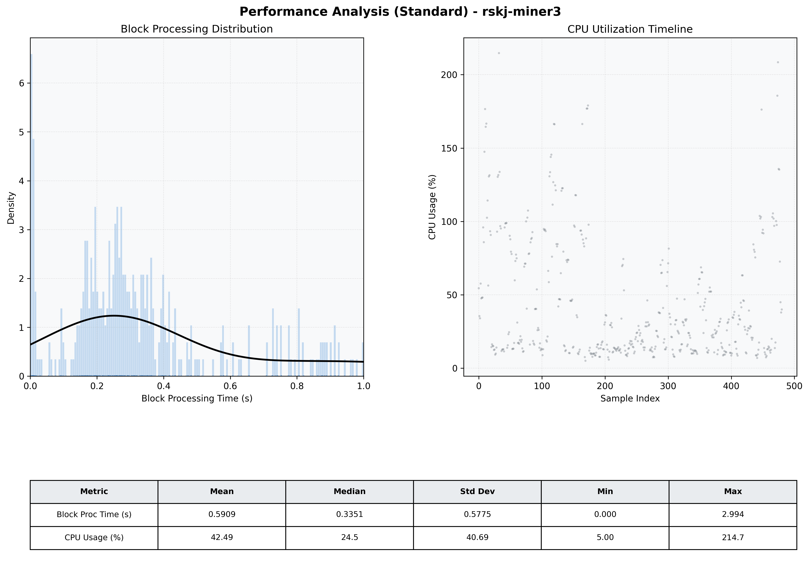

# Miner3 Quantitative Performance Report

| Category | Metric | Unit | Mean | Median | Min | Max |
| :--- | :--- | :--- | :--- | :--- | :--- | :--- |
| Processing | Block Processing Time | s | 0.591 | 0.335 | 0.000 | 2.994 |
|  | BlockExecution JMX | s | 0.317 | 0.171 | 0.002 | 1.000 |
| | Gas Consumed (per block) | M units | 8.22 | 10.00 | 0.00 | 10.00 |
| Resources | CPU Usage per Container | % | 42.49 | 24.54 | 5.00 | 214.71 |
|  | Memory Usage per Container | MiB | 2400.4 | 2396.6 | 2320.9 | 2471.1 |
| JVM | JVM Heap Used | MiB | 975.1 | 948.7 | 62.1 | 1899.0 |
| | JVM Heap Allocated | MiB | 3072.0 | 3072.0 | 3072.0 | 3072.0 |
| JVM GC | GC Copy Time | s | N/A | N/A | N/A | N/A |
| JVM GC | GC MarkSweep Time | s | N/A | N/A | N/A | N/A |
| Disk I/O | Disk Read | MiB/s | 0.000 | 0.000 | 0.000 | 0.000 |
|  | Disk Write | MiB/s | 6.164 | 4.828 | 0.000 | 46.759 |
| Network | Received Network Traffic per Container | KiB/s | 3.11 | 2.34 | 1.16 | 11.73 |
|  | Sent Network Traffic per Container | KiB/s | 11.33 | 10.67 | 9.14 | 18.64 |

