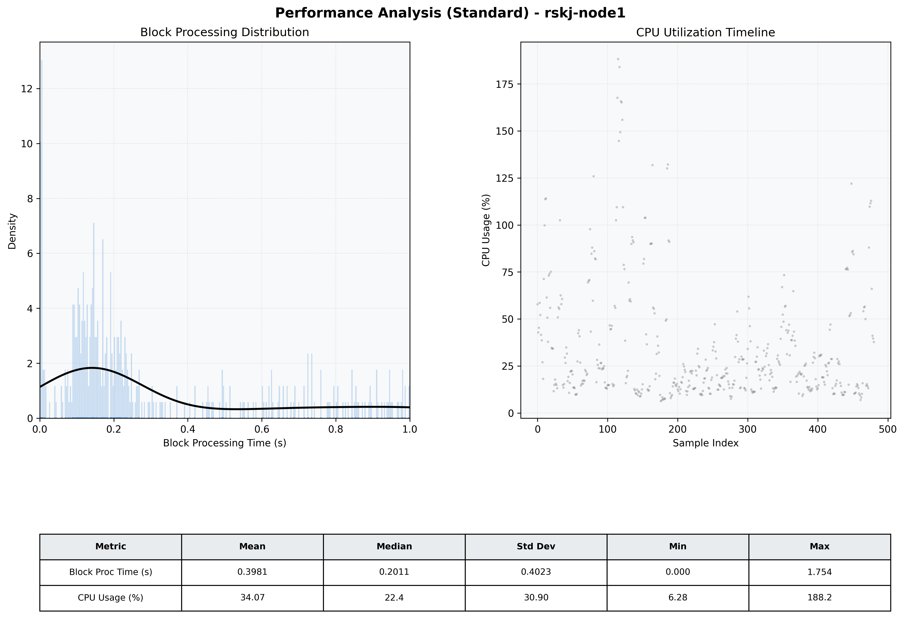

# Node1 Quantitative Performance Report

| Category | Metric | Unit | Mean | Median | Min | Max |
| :--- | :--- | :--- | :--- | :--- | :--- | :--- |
| Processing | Block Processing Time | s | 0.398 | 0.201 | 0.000 | 1.754 |
|  | BlockExecution JMX | s | 0.296 | 0.177 | 0.001 | 0.989 |
| | Gas Consumed (per block) | M units | 8.22 | 10.00 | 0.00 | 10.00 |
| Resources | CPU Usage per Container | % | 34.07 | 22.37 | 6.28 | 188.23 |
|  | Memory Usage per Container | MiB | 1225.6 | 1229.8 | 1169.2 | 1263.3 |
| JVM | JVM Heap Used | MiB | 461.9 | 462.4 | 46.1 | 887.3 |
| | JVM Heap Allocated | MiB | 2969.6 | 2969.6 | 2969.6 | 2969.6 |
| JVM GC | GC Copy Time | s | 0.0004 | 0.0004 | 0.000 | 0.003 |
| JVM GC | GC MarkSweep Time | s | 0.0000 | 0.0000 | 0.000 | 0.000 |
| Disk I/O | Disk Read | MiB/s | 0.000 | 0.000 | 0.000 | 0.000 |
|  | Disk Write | MiB/s | 2.110 | 1.379 | 0.000 | 40.003 |
| Network | Received Network Traffic per Container | KiB/s | 3.18 | 2.36 | 1.15 | 11.71 |
|  | Sent Network Traffic per Container | KiB/s | 11.48 | 10.83 | 9.67 | 17.55 |

