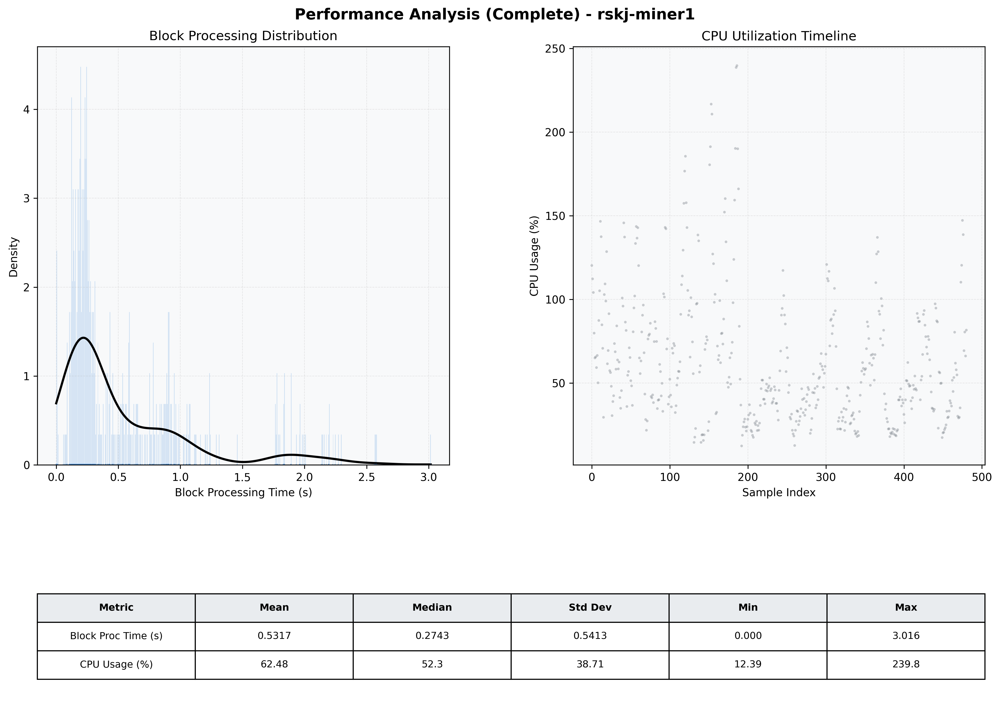

# Miner1 Quantitative Performance Report

| Category | Metric | Unit | Mean | Median | Min | Max |
| :--- | :--- | :--- | :--- | :--- | :--- | :--- |
| Processing | Block Processing Time | s | 0.532 | 0.274 | 0.000 | 3.016 |
|  | BlockExecution JMX | s | 0.324 | 0.187 | 0.002 | 2.165 |
| | Gas Consumed (per block) | M units | 8.22 | 10.00 | 0.00 | 10.00 |
| Resources | CPU Usage per Container | % | 62.48 | 52.26 | 12.39 | 239.79 |
|  | Memory Usage per Container | MiB | 1320.6 | 1321.2 | 1204.8 | 1436.6 |
| JVM | JVM Heap Used | MiB | 467.8 | 463.7 | 43.7 | 884.8 |
| | JVM Heap Allocated | MiB | 2969.6 | 2969.6 | 2969.6 | 2969.6 |
| JVM GC | GC Copy Time | s | 0.0009 | 0.0008 | 0.000 | 0.003 |
| JVM GC | GC MarkSweep Time | s | 0.0000 | 0.0000 | 0.000 | 0.000 |
| Disk I/O | Disk Read | MiB/s | 0.000 | 0.000 | 0.000 | 0.000 |
|  | Disk Write | MiB/s | 169.077 | 82.348 | 0.000 | 635.129 |
| Network | Received Network Traffic per Container | KiB/s | 37.92 | 19.82 | 2.22 | 125.55 |
|  | Sent Network Traffic per Container | KiB/s | 39.90 | 28.20 | 12.12 | 99.66 |

