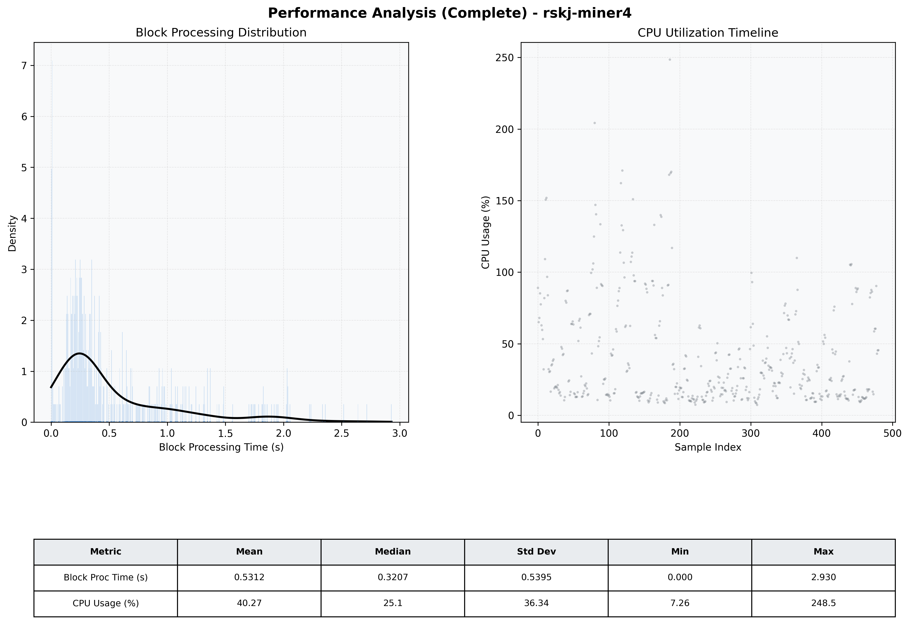

# Miner4 Quantitative Performance Report

| Category | Metric | Unit | Mean | Median | Min | Max |
| :--- | :--- | :--- | :--- | :--- | :--- | :--- |
| Processing | Block Processing Time | s | 0.531 | 0.321 | 0.000 | 2.930 |
|  | BlockExecution JMX | s | 0.308 | 0.176 | 0.002 | 2.217 |
| | Gas Consumed (per block) | M units | 8.22 | 10.00 | 0.00 | 10.00 |
| Resources | CPU Usage per Container | % | 40.27 | 25.10 | 7.26 | 248.49 |
|  | Memory Usage per Container | MiB | 1241.3 | 1243.2 | 1162.9 | 1307.5 |
| JVM | JVM Heap Used | MiB | 459.8 | 455.2 | 45.9 | 879.1 |
| | JVM Heap Allocated | MiB | 2969.6 | 2969.6 | 2969.6 | 2969.6 |
| JVM GC | GC Copy Time | s | 0.0005 | 0.0004 | 0.000 | 0.003 |
| JVM GC | GC MarkSweep Time | s | 0.0000 | 0.0000 | 0.000 | 0.000 |
| Disk I/O | Disk Read | MiB/s | 0.001 | 0.000 | 0.000 | 0.267 |
|  | Disk Write | MiB/s | 6.025 | 4.827 | 0.000 | 48.828 |
| Network | Received Network Traffic per Container | KiB/s | 3.16 | 2.34 | 1.17 | 11.58 |
|  | Sent Network Traffic per Container | KiB/s | 11.81 | 11.12 | 9.54 | 20.37 |

