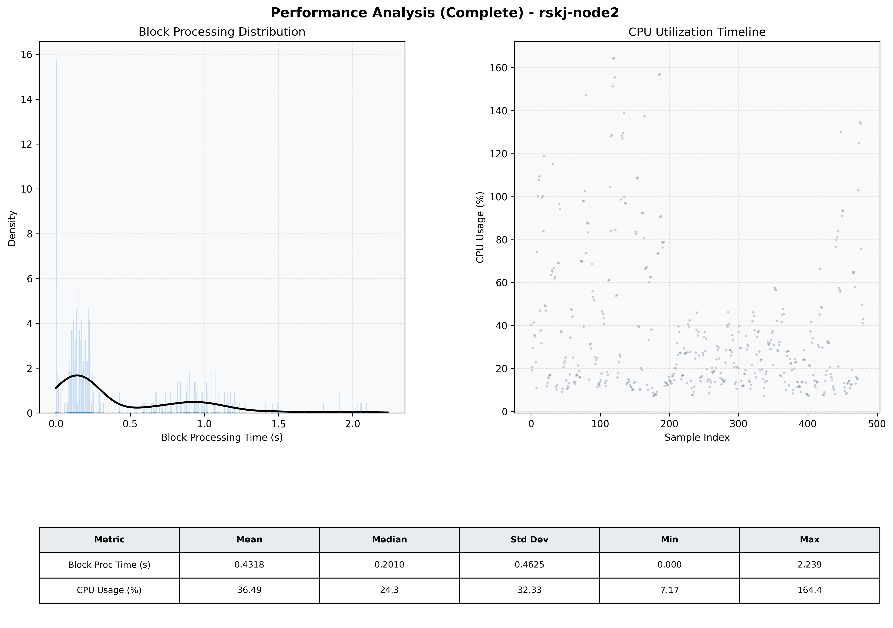

# Node2 Quantitative Performance Report

| Category | Metric | Unit | Mean | Median | Min | Max |
| :--- | :--- | :--- | :--- | :--- | :--- | :--- |
| Processing | Block Processing Time | s | 0.432 | 0.201 | 0.000 | 2.239 |
|  | BlockExecution JMX | s | 0.463 | 0.206 | 0.001 | 2.233 |
| | Gas Consumed (per block) | M units | 8.22 | 10.00 | 0.00 | 10.00 |
| Resources | CPU Usage per Container | % | 36.49 | 24.30 | 7.17 | 164.39 |
|  | Memory Usage per Container | MiB | 2348.7 | 2337.7 | 2288.8 | 2412.6 |
| JVM | JVM Heap Used | MiB | 956.2 | 921.0 | 32.7 | 1880.8 |
| | JVM Heap Allocated | MiB | 3072.0 | 3072.0 | 3072.0 | 3072.0 |
| JVM GC | GC Copy Time | s | N/A | N/A | N/A | N/A |
| JVM GC | GC MarkSweep Time | s | N/A | N/A | N/A | N/A |
| Disk I/O | Disk Read | MiB/s | 0.000 | 0.000 | 0.000 | 0.000 |
|  | Disk Write | MiB/s | 1.964 | 1.379 | 0.000 | 255.862 |
| Network | Received Network Traffic per Container | KiB/s | 3.18 | 2.35 | 1.16 | 11.28 |
|  | Sent Network Traffic per Container | KiB/s | 10.86 | 10.16 | 9.07 | 16.53 |

