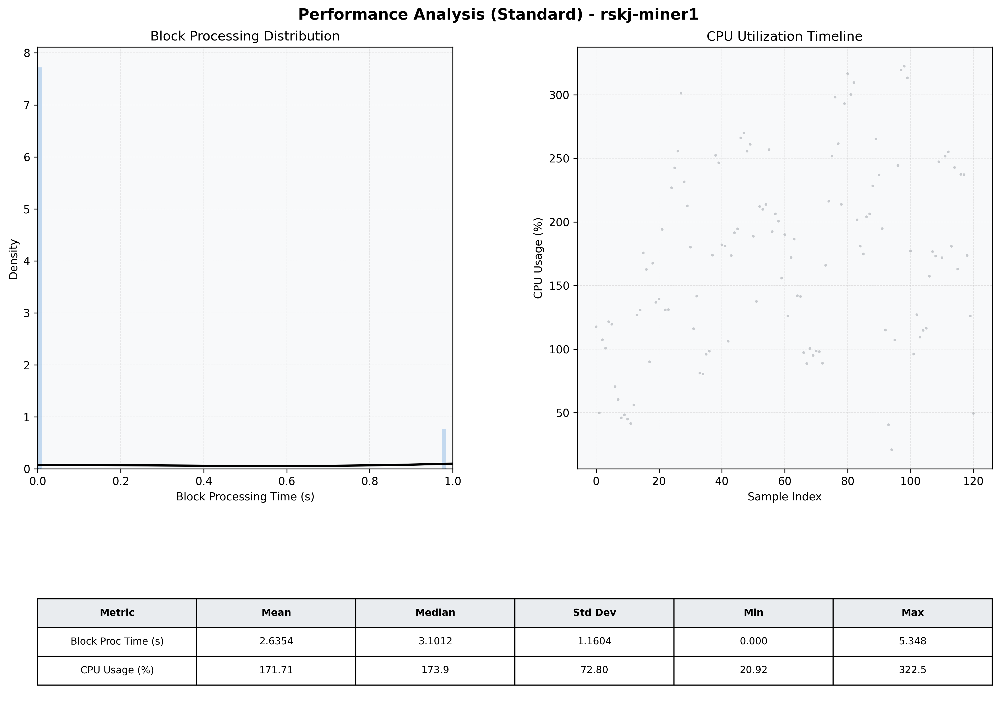

# Miner1 Quantitative Performance Report

| Category | Metric | Unit | Mean | Median | Min | Max |
| :--- | :--- | :--- | :--- | :--- | :--- | :--- |
| Processing | Block Processing Time | s | 2.635 | 3.101 | 0.000 | 5.348 |
|  | BlockExecution JMX | s | 0.166 | 0.002 | 0.002 | 0.983 |
| | Gas Consumed (per block) | M units | 13.76 | 17.00 | 0.00 | 17.00 |
| Resources | CPU Usage per Container | % | 171.71 | 173.88 | 20.92 | 322.47 |
|  | Memory Usage per Container | MiB | 1274.4 | 1265.7 | 1204.2 | 1346.9 |
| JVM | JVM Heap Used | MiB | 442.6 | 435.5 | 63.9 | 872.4 |
| | JVM Heap Allocated | MiB | 2969.6 | 2969.6 | 2969.6 | 2969.6 |
| JVM GC | GC Copy Time | s | 0.0019 | 0.0017 | 0.001 | 0.005 |
| JVM GC | GC MarkSweep Time | s | 0.0000 | 0.0000 | 0.000 | 0.000 |
| Disk I/O | Disk Read | MiB/s | 0.002 | 0.000 | 0.000 | 0.276 |
|  | Disk Write | MiB/s | 175.475 | 84.552 | 0.000 | 566.069 |
| Network | Received Network Traffic per Container | KiB/s | 41.77 | 24.99 | 1.96 | 122.19 |
|  | Sent Network Traffic per Container | KiB/s | 39.52 | 28.51 | 12.44 | 94.74 |

