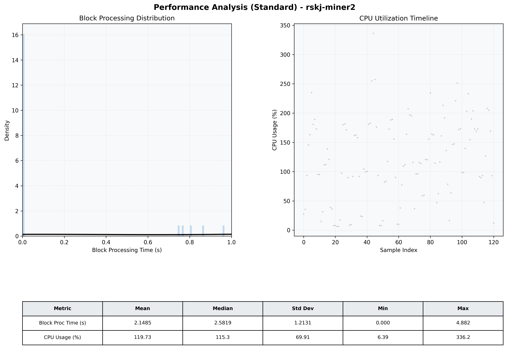

# Miner2 Quantitative Performance Report

| Category | Metric | Unit | Mean | Median | Min | Max |
| :--- | :--- | :--- | :--- | :--- | :--- | :--- |
| Processing | Block Processing Time | s | 2.149 | 2.582 | 0.000 | 4.882 |
|  | BlockExecution JMX | s | 0.149 | 0.004 | 0.001 | 0.957 |
| | Gas Consumed (per block) | M units | 13.76 | 17.00 | 0.00 | 17.00 |
| Resources | CPU Usage per Container | % | 119.73 | 115.33 | 6.39 | 336.23 |
|  | Memory Usage per Container | MiB | 1168.7 | 1167.8 | 1150.5 | 1187.9 |
| JVM | JVM Heap Used | MiB | 444.3 | 457.7 | 67.8 | 859.1 |
| | JVM Heap Allocated | MiB | 2969.6 | 2969.6 | 2969.6 | 2969.6 |
| JVM GC | GC Copy Time | s | 0.0012 | 0.0011 | 0.000 | 0.003 |
| JVM GC | GC MarkSweep Time | s | 0.0000 | 0.0000 | 0.000 | 0.000 |
| Disk I/O | Disk Read | MiB/s | 0.000 | 0.000 | 0.000 | 0.000 |
|  | Disk Write | MiB/s | 5.082 | 4.414 | 0.276 | 16.414 |
| Network | Received Network Traffic per Container | KiB/s | 2.96 | 2.16 | 1.19 | 8.69 |
|  | Sent Network Traffic per Container | KiB/s | 11.62 | 11.00 | 9.66 | 16.25 |

