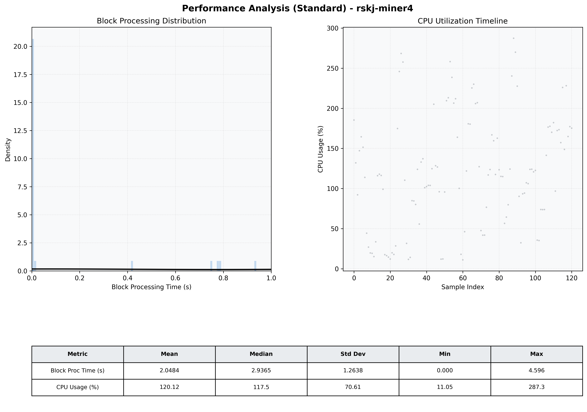

# Miner4 Quantitative Performance Report

| Category | Metric | Unit | Mean | Median | Min | Max |
| :--- | :--- | :--- | :--- | :--- | :--- | :--- |
| Processing | Block Processing Time | s | 2.048 | 2.936 | 0.000 | 4.596 |
|  | BlockExecution JMX | s | 0.217 | 0.003 | 0.001 | 0.931 |
| | Gas Consumed (per block) | M units | 13.76 | 17.00 | 0.00 | 17.00 |
| Resources | CPU Usage per Container | % | 120.12 | 117.48 | 11.05 | 287.31 |
|  | Memory Usage per Container | MiB | 1148.8 | 1146.9 | 1126.2 | 1173.7 |
| JVM | JVM Heap Used | MiB | 450.9 | 472.1 | 45.4 | 834.0 |
| | JVM Heap Allocated | MiB | 2969.6 | 2969.6 | 2969.6 | 2969.6 |
| JVM GC | GC Copy Time | s | 0.0011 | 0.0011 | 0.000 | 0.002 |
| JVM GC | GC MarkSweep Time | s | 0.0000 | 0.0000 | 0.000 | 0.000 |
| Disk I/O | Disk Read | MiB/s | 0.000 | 0.000 | 0.000 | 0.000 |
|  | Disk Write | MiB/s | 5.906 | 4.966 | 0.690 | 41.376 |
| Network | Received Network Traffic per Container | KiB/s | 2.97 | 2.17 | 1.20 | 8.40 |
|  | Sent Network Traffic per Container | KiB/s | 11.62 | 10.94 | 9.84 | 18.54 |

