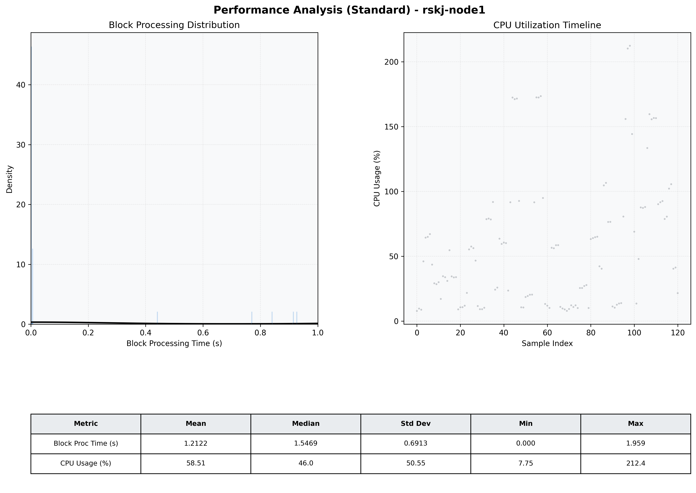

# Node1 Quantitative Performance Report

| Category | Metric | Unit | Mean | Median | Min | Max |
| :--- | :--- | :--- | :--- | :--- | :--- | :--- |
| Processing | Block Processing Time | s | 1.212 | 1.547 | 0.000 | 1.959 |
|  | BlockExecution JMX | s | 0.163 | 0.002 | 0.001 | 0.925 |
| | Gas Consumed (per block) | M units | 13.76 | 17.00 | 0.00 | 17.00 |
| Resources | CPU Usage per Container | % | 58.51 | 46.01 | 7.75 | 212.37 |
|  | Memory Usage per Container | MiB | 1159.0 | 1158.7 | 1144.0 | 1172.5 |
| JVM | JVM Heap Used | MiB | 457.6 | 471.8 | 53.6 | 849.4 |
| | JVM Heap Allocated | MiB | 2969.6 | 2969.6 | 2969.6 | 2969.6 |
| JVM GC | GC Copy Time | s | 0.0007 | 0.0006 | 0.000 | 0.002 |
| JVM GC | GC MarkSweep Time | s | 0.0000 | 0.0000 | 0.000 | 0.000 |
| Disk I/O | Disk Read | MiB/s | 0.000 | 0.000 | 0.000 | 0.000 |
|  | Disk Write | MiB/s | 2.259 | 1.655 | 0.000 | 29.791 |
| Network | Received Network Traffic per Container | KiB/s | 3.02 | 2.22 | 1.16 | 8.47 |
|  | Sent Network Traffic per Container | KiB/s | 11.23 | 10.57 | 9.67 | 15.62 |

