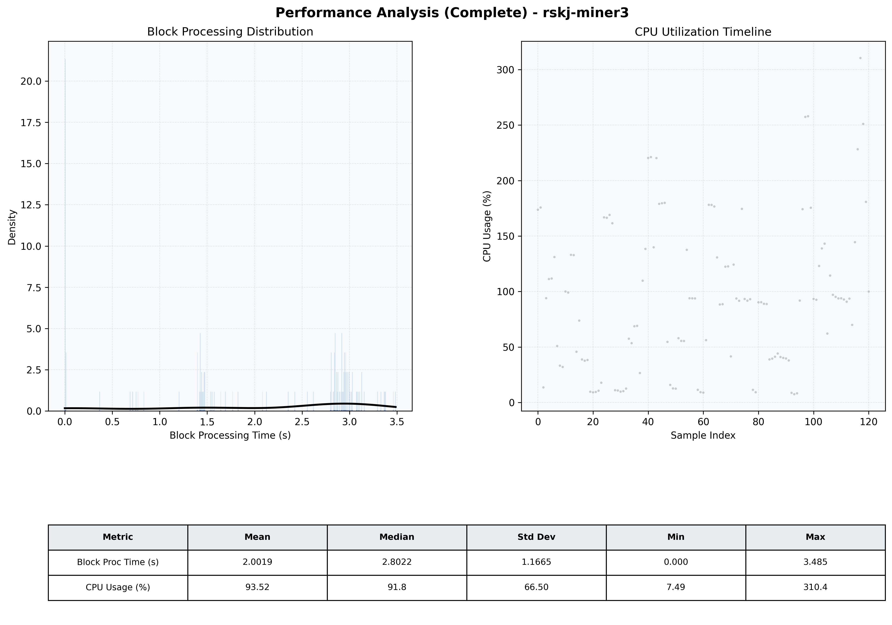

# Miner3 Quantitative Performance Report

| Category | Metric | Unit | Mean | Median | Min | Max |
| :--- | :--- | :--- | :--- | :--- | :--- | :--- |
| Processing | Block Processing Time | s | 2.002 | 2.802 | 0.000 | 3.485 |
|  | BlockExecution JMX | s | 1.221 | 1.423 | 0.002 | 2.117 |
| | Gas Consumed (per block) | M units | 13.76 | 17.00 | 0.00 | 17.00 |
| Resources | CPU Usage per Container | % | 93.52 | 91.84 | 7.49 | 310.38 |
|  | Memory Usage per Container | MiB | 2380.3 | 2378.9 | 2354.8 | 2412.6 |
| JVM | JVM Heap Used | MiB | 1026.0 | 1122.2 | 102.4 | 1882.8 |
| | JVM Heap Allocated | MiB | 3072.0 | 3072.0 | 3072.0 | 3072.0 |
| JVM GC | GC Copy Time | s | N/A | N/A | N/A | N/A |
| JVM GC | GC MarkSweep Time | s | N/A | N/A | N/A | N/A |
| Disk I/O | Disk Read | MiB/s | 0.000 | 0.000 | 0.000 | 0.000 |
|  | Disk Write | MiB/s | 5.445 | 4.138 | 0.276 | 43.313 |
| Network | Received Network Traffic per Container | KiB/s | 2.96 | 2.20 | 1.21 | 8.28 |
|  | Sent Network Traffic per Container | KiB/s | 10.98 | 10.26 | 9.38 | 17.74 |

