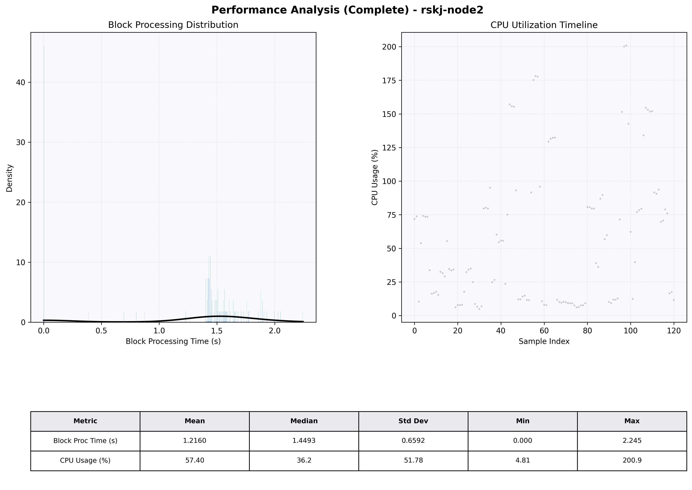

# Node2 Quantitative Performance Report

| Category | Metric | Unit | Mean | Median | Min | Max |
| :--- | :--- | :--- | :--- | :--- | :--- | :--- |
| Processing | Block Processing Time | s | 1.216 | 1.449 | 0.000 | 2.245 |
|  | BlockExecution JMX | s | 1.296 | 1.455 | 0.001 | 2.243 |
| | Gas Consumed (per block) | M units | 13.76 | 17.00 | 0.00 | 17.00 |
| Resources | CPU Usage per Container | % | 57.40 | 36.18 | 4.81 | 200.90 |
|  | Memory Usage per Container | MiB | 2313.9 | 2313.4 | 2302.2 | 2324.2 |
| JVM | JVM Heap Used | MiB | 923.1 | 917.8 | 36.4 | 1870.4 |
| | JVM Heap Allocated | MiB | 3072.0 | 3072.0 | 3072.0 | 3072.0 |
| JVM GC | GC Copy Time | s | N/A | N/A | N/A | N/A |
| JVM GC | GC MarkSweep Time | s | N/A | N/A | N/A | N/A |
| Disk I/O | Disk Read | MiB/s | 0.000 | 0.000 | 0.000 | 0.000 |
|  | Disk Write | MiB/s | 1.578 | 1.517 | 0.000 | 3.862 |
| Network | Received Network Traffic per Container | KiB/s | 3.00 | 2.23 | 1.16 | 8.11 |
|  | Sent Network Traffic per Container | KiB/s | 10.61 | 9.96 | 9.08 | 15.26 |

