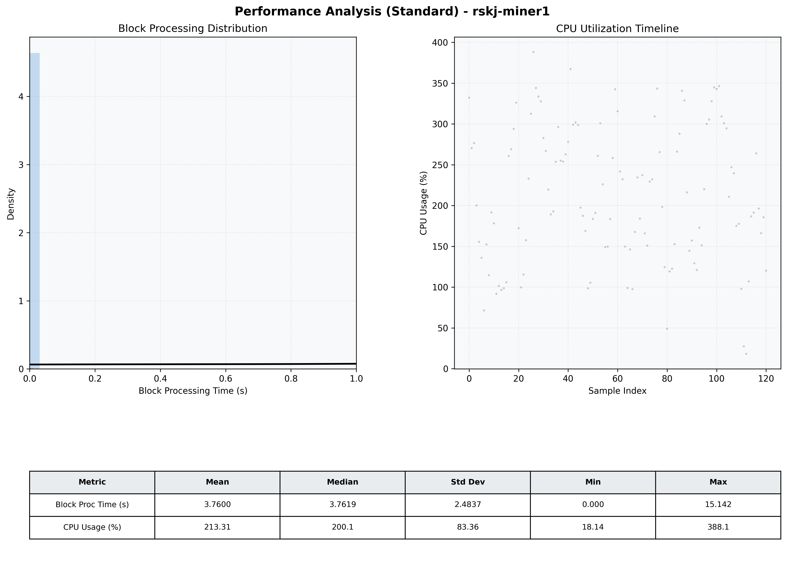

# Miner1 Quantitative Performance Report

| Category | Metric | Unit | Mean | Median | Min | Max |
| :--- | :--- | :--- | :--- | :--- | :--- | :--- |
| Processing | Block Processing Time | s | 3.760 | 3.762 | 0.000 | 15.142 |
|  | BlockExecution JMX | s | 0.003 | 0.002 | 0.001 | 0.005 |
| | Gas Consumed (per block) | M units | 19.65 | 25.00 | 0.00 | 25.00 |
| Resources | CPU Usage per Container | % | 213.31 | 200.10 | 18.14 | 388.13 |
|  | Memory Usage per Container | MiB | 1338.0 | 1345.2 | 1249.8 | 1408.5 |
| JVM | JVM Heap Used | MiB | 499.1 | 470.1 | 122.8 | 957.2 |
| | JVM Heap Allocated | MiB | 2969.6 | 2969.6 | 2969.6 | 2969.6 |
| JVM GC | GC Copy Time | s | 0.0041 | 0.0037 | 0.001 | 0.014 |
| JVM GC | GC MarkSweep Time | s | 0.0000 | 0.0000 | 0.000 | 0.000 |
| Disk I/O | Disk Read | MiB/s | 0.000 | 0.000 | 0.000 | 0.000 |
|  | Disk Write | MiB/s | 169.255 | 112.969 | 0.000 | 601.814 |
| Network | Received Network Traffic per Container | KiB/s | 40.78 | 22.81 | 2.59 | 124.22 |
|  | Sent Network Traffic per Container | KiB/s | 38.80 | 30.38 | 12.81 | 96.14 |

