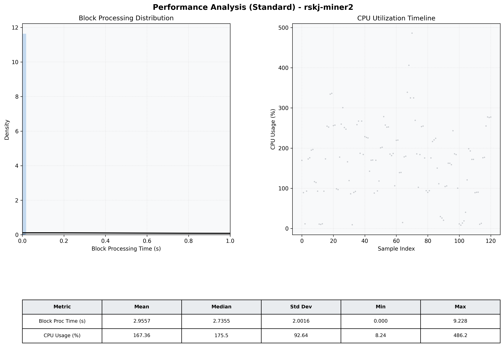

# Miner2 Quantitative Performance Report

| Category | Metric | Unit | Mean | Median | Min | Max |
| :--- | :--- | :--- | :--- | :--- | :--- | :--- |
| Processing | Block Processing Time | s | 2.956 | 2.735 | 0.000 | 9.228 |
|  | BlockExecution JMX | s | 0.003 | 0.002 | 0.001 | 0.006 |
| | Gas Consumed (per block) | M units | 19.65 | 25.00 | 0.00 | 25.00 |
| Resources | CPU Usage per Container | % | 167.36 | 175.45 | 8.24 | 486.16 |
|  | Memory Usage per Container | MiB | 1236.4 | 1238.4 | 1208.9 | 1264.6 |
| JVM | JVM Heap Used | MiB | 485.7 | 487.1 | 59.5 | 888.1 |
| | JVM Heap Allocated | MiB | 2969.6 | 2969.6 | 2969.6 | 2969.6 |
| JVM GC | GC Copy Time | s | 0.0028 | 0.0028 | 0.000 | 0.007 |
| JVM GC | GC MarkSweep Time | s | 0.0000 | 0.0000 | 0.000 | 0.000 |
| Disk I/O | Disk Read | MiB/s | 0.000 | 0.000 | 0.000 | 0.000 |
|  | Disk Write | MiB/s | 5.355 | 4.828 | 0.552 | 12.413 |
| Network | Received Network Traffic per Container | KiB/s | 3.01 | 2.25 | 1.30 | 8.48 |
|  | Sent Network Traffic per Container | KiB/s | 11.68 | 11.16 | 10.02 | 18.44 |

