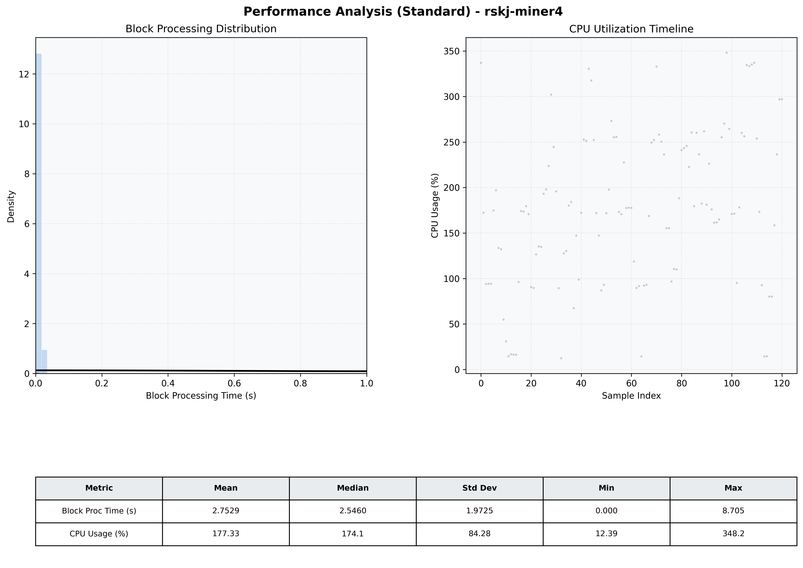

# Miner4 Quantitative Performance Report

| Category | Metric | Unit | Mean | Median | Min | Max |
| :--- | :--- | :--- | :--- | :--- | :--- | :--- |
| Processing | Block Processing Time | s | 2.753 | 2.546 | 0.000 | 8.705 |
|  | BlockExecution JMX | s | 0.004 | 0.003 | 0.002 | 0.013 |
| | Gas Consumed (per block) | M units | 19.65 | 25.00 | 0.00 | 25.00 |
| Resources | CPU Usage per Container | % | 177.33 | 174.09 | 12.39 | 348.16 |
|  | Memory Usage per Container | MiB | 1210.3 | 1209.8 | 1185.6 | 1238.6 |
| JVM | JVM Heap Used | MiB | 487.9 | 504.3 | 67.2 | 888.5 |
| | JVM Heap Allocated | MiB | 2969.6 | 2969.6 | 2969.6 | 2969.6 |
| JVM GC | GC Copy Time | s | 0.0028 | 0.0029 | 0.000 | 0.008 |
| JVM GC | GC MarkSweep Time | s | 0.0000 | 0.0000 | 0.000 | 0.000 |
| Disk I/O | Disk Read | MiB/s | 0.000 | 0.000 | 0.000 | 0.000 |
|  | Disk Write | MiB/s | 5.847 | 5.244 | 0.552 | 44.279 |
| Network | Received Network Traffic per Container | KiB/s | 3.02 | 2.29 | 1.23 | 8.84 |
|  | Sent Network Traffic per Container | KiB/s | 11.84 | 10.95 | 10.06 | 17.84 |

