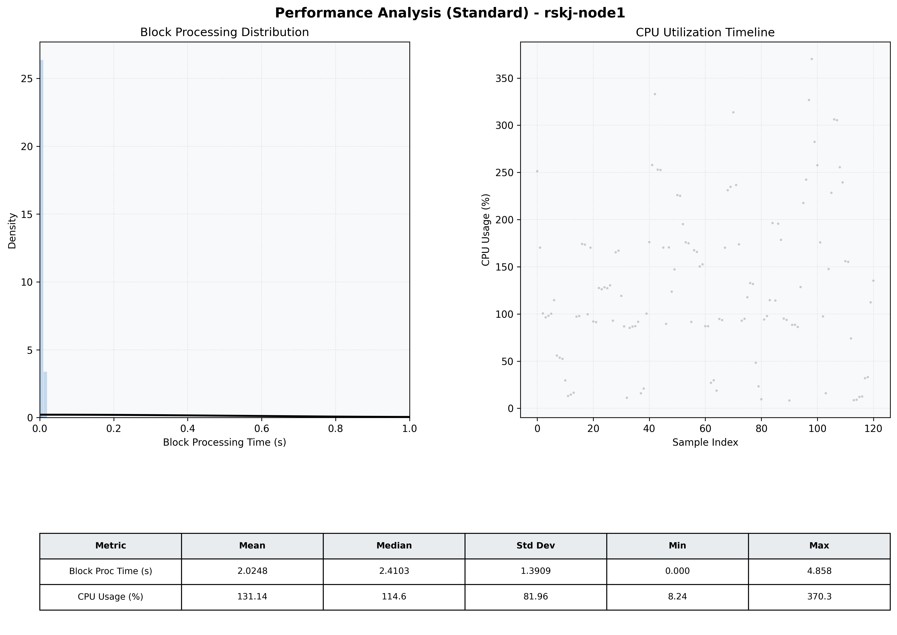

# Node1 Quantitative Performance Report

| Category | Metric | Unit | Mean | Median | Min | Max |
| :--- | :--- | :--- | :--- | :--- | :--- | :--- |
| Processing | Block Processing Time | s | 2.025 | 2.410 | 0.000 | 4.858 |
|  | BlockExecution JMX | s | 0.003 | 0.002 | 0.001 | 0.014 |
| | Gas Consumed (per block) | M units | 19.65 | 25.00 | 0.00 | 25.00 |
| Resources | CPU Usage per Container | % | 131.14 | 114.64 | 8.24 | 370.25 |
|  | Memory Usage per Container | MiB | 1169.0 | 1167.4 | 1155.5 | 1182.9 |
| JVM | JVM Heap Used | MiB | 474.9 | 487.1 | 60.6 | 862.4 |
| | JVM Heap Allocated | MiB | 2969.6 | 2969.6 | 2969.6 | 2969.6 |
| JVM GC | GC Copy Time | s | 0.0021 | 0.0019 | 0.000 | 0.008 |
| JVM GC | GC MarkSweep Time | s | 0.0000 | 0.0000 | 0.000 | 0.000 |
| Disk I/O | Disk Read | MiB/s | 0.000 | 0.000 | 0.000 | 0.000 |
|  | Disk Write | MiB/s | 2.246 | 1.655 | 0.552 | 30.619 |
| Network | Received Network Traffic per Container | KiB/s | 3.07 | 2.27 | 1.29 | 8.96 |
|  | Sent Network Traffic per Container | KiB/s | 11.25 | 10.54 | 9.96 | 15.89 |

