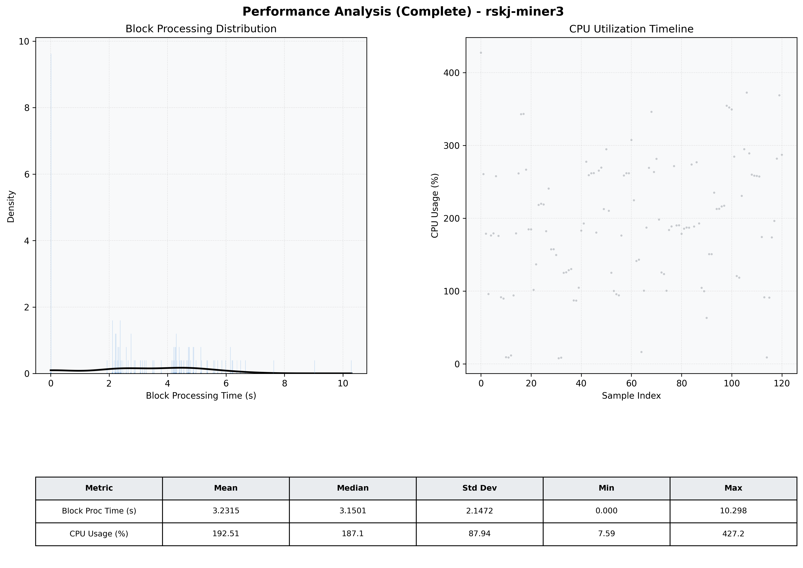

# Miner3 Quantitative Performance Report

| Category | Metric | Unit | Mean | Median | Min | Max |
| :--- | :--- | :--- | :--- | :--- | :--- | :--- |
| Processing | Block Processing Time | s | 3.231 | 3.150 | 0.000 | 10.298 |
|  | BlockExecution JMX | s | 2.191 | 2.267 | 0.001 | 6.360 |
| | Gas Consumed (per block) | M units | 19.65 | 25.00 | 0.00 | 25.00 |
| Resources | CPU Usage per Container | % | 192.51 | 187.13 | 7.59 | 427.20 |
|  | Memory Usage per Container | MiB | 2418.2 | 2417.9 | 2398.9 | 2439.8 |
| JVM | JVM Heap Used | MiB | 999.9 | 956.4 | 81.2 | 1899.0 |
| | JVM Heap Allocated | MiB | 3072.0 | 3072.0 | 3072.0 | 3072.0 |
| JVM GC | GC Copy Time | s | N/A | N/A | N/A | N/A |
| JVM GC | GC MarkSweep Time | s | N/A | N/A | N/A | N/A |
| Disk I/O | Disk Read | MiB/s | 0.000 | 0.000 | 0.000 | 0.000 |
|  | Disk Write | MiB/s | 5.945 | 4.965 | 0.552 | 44.417 |
| Network | Received Network Traffic per Container | KiB/s | 3.01 | 2.28 | 1.31 | 8.52 |
|  | Sent Network Traffic per Container | KiB/s | 11.10 | 10.29 | 9.44 | 17.54 |

