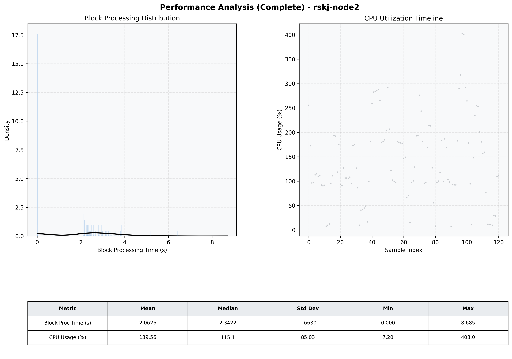

# Node2 Quantitative Performance Report

| Category | Metric | Unit | Mean | Median | Min | Max |
| :--- | :--- | :--- | :--- | :--- | :--- | :--- |
| Processing | Block Processing Time | s | 2.063 | 2.342 | 0.000 | 8.685 |
|  | BlockExecution JMX | s | 2.605 | 2.508 | 0.001 | 10.589 |
| | Gas Consumed (per block) | M units | 19.65 | 25.00 | 0.00 | 25.00 |
| Resources | CPU Usage per Container | % | 139.56 | 115.12 | 7.20 | 403.00 |
|  | Memory Usage per Container | MiB | 2332.4 | 2332.6 | 2321.7 | 2348.3 |
| JVM | JVM Heap Used | MiB | 1014.8 | 1020.2 | 71.5 | 1881.5 |
| | JVM Heap Allocated | MiB | 3072.0 | 3072.0 | 3072.0 | 3072.0 |
| JVM GC | GC Copy Time | s | N/A | N/A | N/A | N/A |
| JVM GC | GC MarkSweep Time | s | N/A | N/A | N/A | N/A |
| Disk I/O | Disk Read | MiB/s | 0.000 | 0.000 | 0.000 | 0.000 |
|  | Disk Write | MiB/s | 1.741 | 1.655 | 0.000 | 4.966 |
| Network | Received Network Traffic per Container | KiB/s | 3.10 | 2.31 | 1.31 | 8.75 |
|  | Sent Network Traffic per Container | KiB/s | 10.60 | 9.92 | 9.09 | 14.77 |

