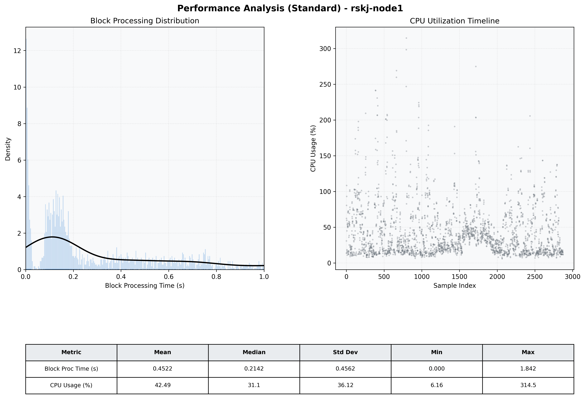

# Node1 Quantitative Performance Report

| Category | Metric | Unit | Mean | Median | Min | Max |
| :--- | :--- | :--- | :--- | :--- | :--- | :--- |
| Processing | Block Processing Time | s | 0.452 | 0.214 | 0.000 | 1.842 |
|  | BlockExecution JMX | s | 0.280 | 0.152 | 0.001 | 0.999 |
| | Gas Consumed (per block) | M units | 5.57 | 7.00 | 0.00 | 7.00 |
| Resources | CPU Usage per Container | % | 42.49 | 31.08 | 6.16 | 314.54 |
|  | Memory Usage per Container | MiB | 1576.3 | 1592.9 | 1399.1 | 1728.2 |
| JVM | JVM Heap Used | MiB | 689.6 | 699.5 | 162.9 | 1210.3 |
| | JVM Heap Allocated | MiB | 2969.6 | 2969.6 | 2969.6 | 2969.6 |
| JVM GC | GC Copy Time | s | 0.0007 | 0.0006 | 0.000 | 0.004 |
| JVM GC | GC MarkSweep Time | s | 0.0000 | 0.0000 | 0.000 | 0.000 |
| Disk I/O | Disk Read | MiB/s | 0.001 | 0.000 | 0.000 | 0.690 |
|  | Disk Write | MiB/s | 4.318 | 1.379 | 0.000 | 2305.714 |
| Network | Received Network Traffic per Container | KiB/s | 3.10 | 2.36 | 0.53 | 12.44 |
|  | Sent Network Traffic per Container | KiB/s | 11.09 | 10.80 | 4.68 | 18.88 |

