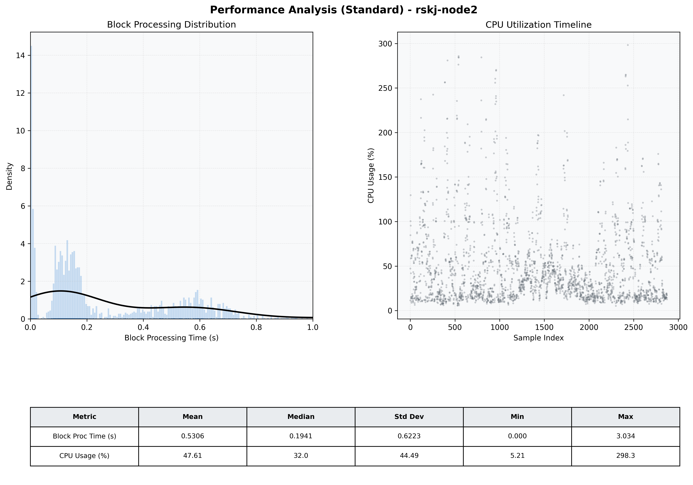

# Node2 Quantitative Performance Report

| Category | Metric | Unit | Mean | Median | Min | Max |
| :--- | :--- | :--- | :--- | :--- | :--- | :--- |
| Processing | Block Processing Time | s | 0.531 | 0.194 | 0.000 | 3.034 |
|  | BlockExecution JMX | s | 0.259 | 0.149 | 0.001 | 0.986 |
| | Gas Consumed (per block) | M units | 5.57 | 7.00 | 0.00 | 7.00 |
| Resources | CPU Usage per Container | % | 47.61 | 31.97 | 5.21 | 298.27 |
|  | Memory Usage per Container | MiB | 2791.9 | 2817.1 | 2597.9 | 2973.3 |
| JVM | JVM Heap Used | MiB | 1224.8 | 1220.3 | 174.6 | 2244.8 |
| | JVM Heap Allocated | MiB | 3072.0 | 3072.0 | 3072.0 | 3072.0 |
| JVM GC | GC Copy Time | s | N/A | N/A | N/A | N/A |
| JVM GC | GC MarkSweep Time | s | N/A | N/A | N/A | N/A |
| Disk I/O | Disk Read | MiB/s | 0.001 | 0.000 | 0.000 | 0.690 |
|  | Disk Write | MiB/s | 3.563 | 1.379 | 0.000 | 2278.956 |
| Network | Received Network Traffic per Container | KiB/s | 3.10 | 2.37 | 0.55 | 12.46 |
|  | Sent Network Traffic per Container | KiB/s | 10.44 | 10.10 | 4.37 | 18.21 |

