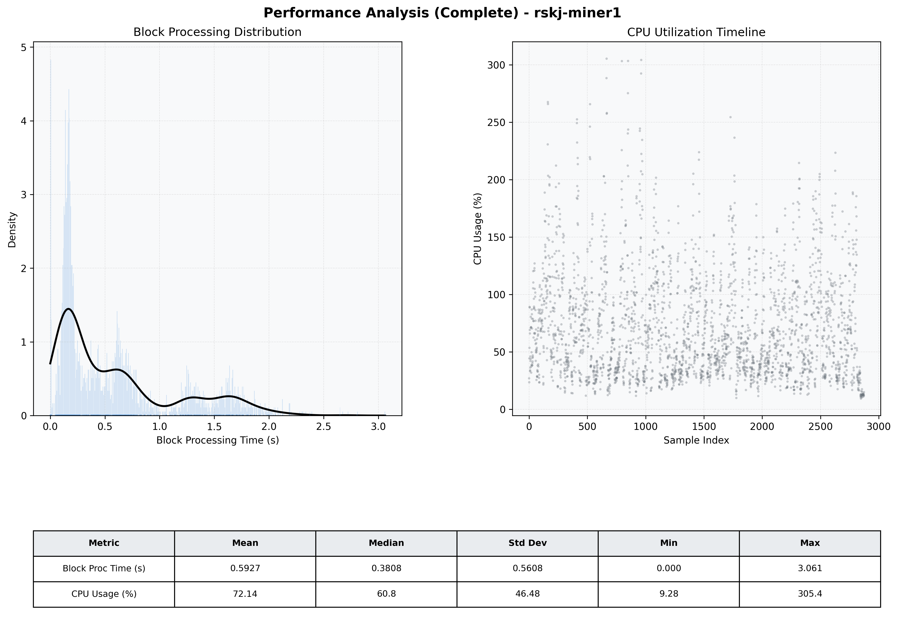

# Miner1 Quantitative Performance Report

| Category | Metric | Unit | Mean | Median | Min | Max |
| :--- | :--- | :--- | :--- | :--- | :--- | :--- |
| Processing | Block Processing Time | s | 0.593 | 0.381 | 0.000 | 3.061 |
|  | BlockExecution JMX | s | 0.366 | 0.255 | 0.001 | 1.894 |
| | Gas Consumed (per block) | M units | 5.57 | 7.00 | 0.00 | 7.00 |
| Resources | CPU Usage per Container | % | 72.14 | 60.79 | 9.28 | 305.42 |
|  | Memory Usage per Container | MiB | 2094.5 | 2102.8 | 1657.7 | 2523.7 |
| JVM | JVM Heap Used | MiB | 797.9 | 794.5 | 240.9 | 1370.1 |
| | JVM Heap Allocated | MiB | 2969.6 | 2969.6 | 2969.6 | 2969.6 |
| JVM GC | GC Copy Time | s | 0.0013 | 0.0011 | 0.000 | 0.007 |
| JVM GC | GC MarkSweep Time | s | 0.0000 | 0.0000 | 0.000 | 0.000 |
| Disk I/O | Disk Read | MiB/s | 0.001 | 0.000 | 0.000 | 0.690 |
|  | Disk Write | MiB/s | 163.137 | 78.480 | 0.000 | 2304.748 |
| Network | Received Network Traffic per Container | KiB/s | 36.92 | 19.30 | 0.57 | 131.55 |
|  | Sent Network Traffic per Container | KiB/s | 38.14 | 25.87 | 4.71 | 111.50 |

