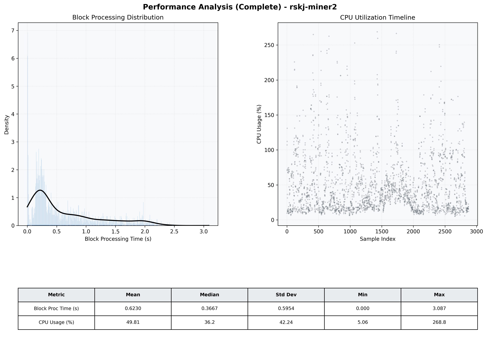

# Miner2 Quantitative Performance Report

| Category | Metric | Unit | Mean | Median | Min | Max |
| :--- | :--- | :--- | :--- | :--- | :--- | :--- |
| Processing | Block Processing Time | s | 0.623 | 0.367 | 0.000 | 3.087 |
|  | BlockExecution JMX | s | 0.369 | 0.236 | 0.001 | 2.384 |
| | Gas Consumed (per block) | M units | 5.57 | 7.00 | 0.00 | 7.00 |
| Resources | CPU Usage per Container | % | 49.81 | 36.20 | 5.06 | 268.81 |
|  | Memory Usage per Container | MiB | 1719.7 | 1731.6 | 1461.8 | 1953.8 |
| JVM | JVM Heap Used | MiB | 753.0 | 754.4 | 194.5 | 1298.1 |
| | JVM Heap Allocated | MiB | 2969.6 | 2969.6 | 2969.6 | 2969.6 |
| JVM GC | GC Copy Time | s | 0.0009 | 0.0007 | 0.000 | 0.005 |
| JVM GC | GC MarkSweep Time | s | 0.0000 | 0.0000 | 0.000 | 0.000 |
| Disk I/O | Disk Read | MiB/s | 0.001 | 0.000 | 0.000 | 0.690 |
|  | Disk Write | MiB/s | 7.801 | 4.552 | 0.000 | 2296.000 |
| Network | Received Network Traffic per Container | KiB/s | 3.08 | 2.35 | 0.56 | 12.11 |
|  | Sent Network Traffic per Container | KiB/s | 11.37 | 11.05 | 4.70 | 20.94 |

