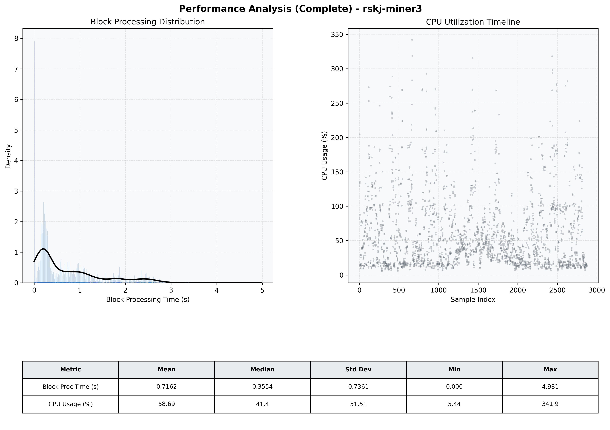

# Miner3 Quantitative Performance Report

| Category | Metric | Unit | Mean | Median | Min | Max |
| :--- | :--- | :--- | :--- | :--- | :--- | :--- |
| Processing | Block Processing Time | s | 0.716 | 0.355 | 0.000 | 4.981 |
|  | BlockExecution JMX | s | 0.436 | 0.264 | 0.001 | 3.044 |
| | Gas Consumed (per block) | M units | 5.57 | 7.00 | 0.00 | 7.00 |
| Resources | CPU Usage per Container | % | 58.69 | 41.42 | 5.44 | 341.91 |
|  | Memory Usage per Container | MiB | 2879.4 | 2889.0 | 2628.3 | 3126.1 |
| JVM | JVM Heap Used | MiB | 1252.2 | 1268.0 | 201.7 | 2291.5 |
| | JVM Heap Allocated | MiB | 3072.0 | 3072.0 | 3072.0 | 3072.0 |
| JVM GC | GC Copy Time | s | N/A | N/A | N/A | N/A |
| JVM GC | GC MarkSweep Time | s | N/A | N/A | N/A | N/A |
| Disk I/O | Disk Read | MiB/s | 0.001 | 0.000 | 0.000 | 0.690 |
|  | Disk Write | MiB/s | 7.646 | 4.552 | 0.000 | 1304.552 |
| Network | Received Network Traffic per Container | KiB/s | 3.07 | 2.33 | 0.53 | 12.66 |
|  | Sent Network Traffic per Container | KiB/s | 10.82 | 10.44 | 4.12 | 21.54 |

