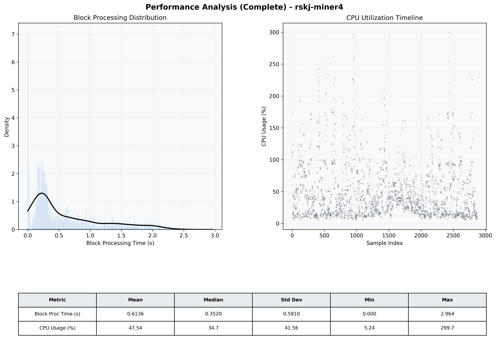

# Miner4 Quantitative Performance Report

| Category | Metric | Unit | Mean | Median | Min | Max |
| :--- | :--- | :--- | :--- | :--- | :--- | :--- |
| Processing | Block Processing Time | s | 0.614 | 0.352 | 0.000 | 2.964 |
|  | BlockExecution JMX | s | 0.371 | 0.240 | 0.001 | 1.993 |
| | Gas Consumed (per block) | M units | 5.57 | 7.00 | 0.00 | 7.00 |
| Resources | CPU Usage per Container | % | 47.54 | 34.71 | 5.24 | 299.70 |
|  | Memory Usage per Container | MiB | 1679.6 | 1693.5 | 1413.5 | 1930.9 |
| JVM | JVM Heap Used | MiB | 735.9 | 738.1 | 195.8 | 1274.2 |
| | JVM Heap Allocated | MiB | 2969.6 | 2969.6 | 2969.6 | 2969.6 |
| JVM GC | GC Copy Time | s | 0.0008 | 0.0006 | 0.000 | 0.004 |
| JVM GC | GC MarkSweep Time | s | 0.0000 | 0.0000 | 0.000 | 0.000 |
| Disk I/O | Disk Read | MiB/s | 0.001 | 0.000 | 0.000 | 0.690 |
|  | Disk Write | MiB/s | 8.580 | 4.828 | 0.000 | 2308.138 |
| Network | Received Network Traffic per Container | KiB/s | 3.07 | 2.31 | 0.54 | 12.26 |
|  | Sent Network Traffic per Container | KiB/s | 11.44 | 11.07 | 4.68 | 24.32 |

