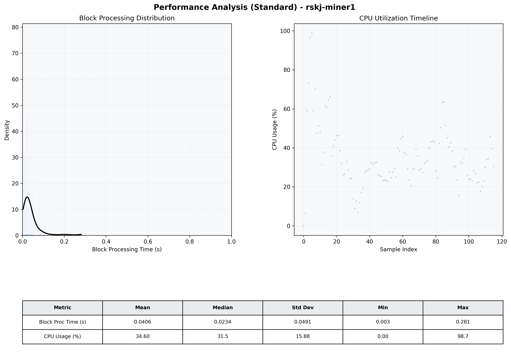

# Miner1 Quantitative Performance Report

| Category | Metric | Unit | Mean | Median | Min | Max |
| :--- | :--- | :--- | :--- | :--- | :--- | :--- |
| Processing | Block Processing Time | s | 0.041 | 0.023 | 0.003 | 0.281 |
|  | BlockExecution JMX | s | 0.025 | 0.015 | 0.002 | 0.160 |
| | Gas Consumed (per block) | M units | 4.27 | 7.00 | 0.00 | 7.00 |
| Resources | CPU Usage per Container | % | 34.60 | 31.46 | 0.00 | 98.73 |
|  | Memory Usage per Container | MiB | 1351.4 | 1348.6 | 676.7 | 1450.0 |
| JVM | JVM Heap Used | MiB | 462.5 | 462.7 | 54.7 | 844.0 |
| | JVM Heap Allocated | MiB | 2969.6 | 2969.6 | 2969.6 | 2969.6 |
| JVM GC | GC Copy Time | s | 0.0003 | 0.0003 | 0.000 | 0.001 |
| JVM GC | GC MarkSweep Time | s | 0.0000 | 0.0000 | 0.000 | 0.002 |
| Disk I/O | Disk Read | MiB/s | 0.000 | 0.000 | 0.000 | 0.000 |
|  | Disk Write | MiB/s | 38.787 | 22.483 | 0.000 | 547.448 |
| Network | Received Network Traffic per Container | KiB/s | 11.25 | 7.38 | 0.00 | 40.55 |
|  | Sent Network Traffic per Container | KiB/s | 21.61 | 16.86 | 0.00 | 64.76 |

