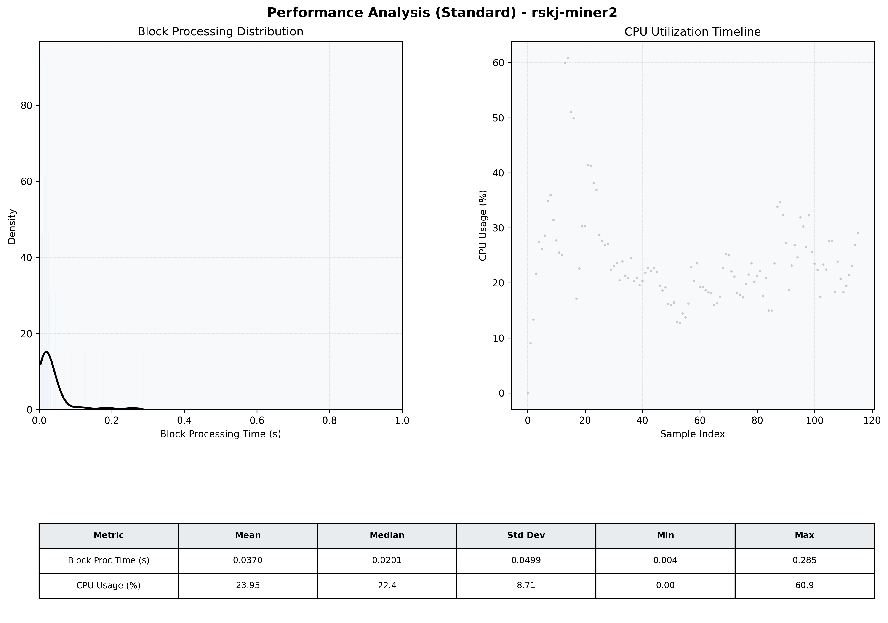

# Miner2 Quantitative Performance Report

| Category | Metric | Unit | Mean | Median | Min | Max |
| :--- | :--- | :--- | :--- | :--- | :--- | :--- |
| Processing | Block Processing Time | s | 0.037 | 0.020 | 0.004 | 0.285 |
|  | BlockExecution JMX | s | 0.023 | 0.013 | 0.003 | 0.177 |
| | Gas Consumed (per block) | M units | 4.27 | 7.00 | 0.00 | 7.00 |
| Resources | CPU Usage per Container | % | 23.95 | 22.41 | 0.00 | 60.87 |
|  | Memory Usage per Container | MiB | 1314.7 | 1324.2 | 663.8 | 1345.7 |
| JVM | JVM Heap Used | MiB | 429.4 | 430.1 | 26.3 | 840.7 |
| | JVM Heap Allocated | MiB | 2969.6 | 2969.6 | 2969.6 | 2969.6 |
| JVM GC | GC Copy Time | s | 0.0002 | 0.0002 | 0.000 | 0.001 |
| JVM GC | GC MarkSweep Time | s | 0.0000 | 0.0000 | 0.000 | 0.002 |
| Disk I/O | Disk Read | MiB/s | 0.000 | 0.000 | 0.000 | 0.000 |
|  | Disk Write | MiB/s | 10.805 | 5.241 | 0.000 | 547.448 |
| Network | Received Network Traffic per Container | KiB/s | 2.59 | 1.89 | 0.00 | 11.86 |
|  | Sent Network Traffic per Container | KiB/s | 11.17 | 10.61 | 0.00 | 20.70 |

