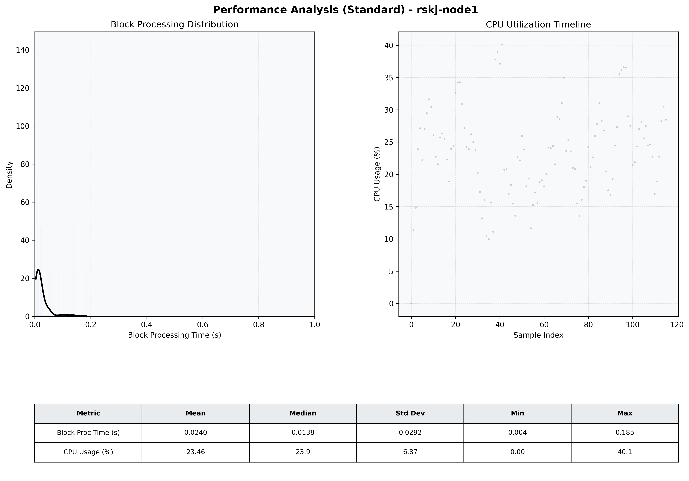

# Node1 Quantitative Performance Report

| Category | Metric | Unit | Mean | Median | Min | Max |
| :--- | :--- | :--- | :--- | :--- | :--- | :--- |
| Processing | Block Processing Time | s | 0.024 | 0.014 | 0.004 | 0.185 |
|  | BlockExecution JMX | s | 0.020 | 0.009 | 0.002 | 0.183 |
| | Gas Consumed (per block) | M units | 4.27 | 7.00 | 0.00 | 7.00 |
| Resources | CPU Usage per Container | % | 23.46 | 23.87 | 0.00 | 40.09 |
|  | Memory Usage per Container | MiB | 1307.8 | 1326.2 | 607.1 | 1337.6 |
| JVM | JVM Heap Used | MiB | 454.5 | 452.9 | 56.3 | 843.5 |
| | JVM Heap Allocated | MiB | 2969.6 | 2969.6 | 2969.6 | 2969.6 |
| JVM GC | GC Copy Time | s | 0.0002 | 0.0002 | 0.000 | 0.001 |
| JVM GC | GC MarkSweep Time | s | 0.0000 | 0.0000 | 0.000 | 0.002 |
| Disk I/O | Disk Read | MiB/s | 0.000 | 0.000 | 0.000 | 0.000 |
|  | Disk Write | MiB/s | 7.739 | 2.897 | 0.000 | 546.621 |
| Network | Received Network Traffic per Container | KiB/s | 2.59 | 1.90 | 0.00 | 11.69 |
|  | Sent Network Traffic per Container | KiB/s | 10.93 | 10.43 | 0.00 | 18.36 |

