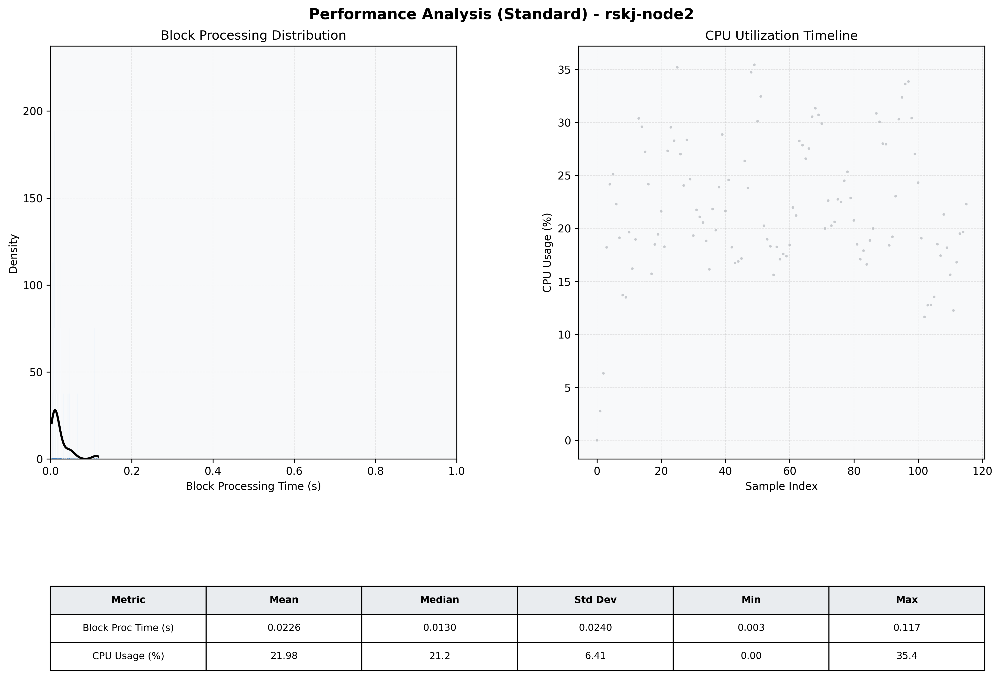

# Node2 Quantitative Performance Report

| Category | Metric | Unit | Mean | Median | Min | Max |
| :--- | :--- | :--- | :--- | :--- | :--- | :--- |
| Processing | Block Processing Time | s | 0.023 | 0.013 | 0.003 | 0.117 |
|  | BlockExecution JMX | s | 0.019 | 0.009 | 0.002 | 0.113 |
| | Gas Consumed (per block) | M units | 4.27 | 7.00 | 0.00 | 7.00 |
| Resources | CPU Usage per Container | % | 21.98 | 21.15 | 0.00 | 35.45 |
|  | Memory Usage per Container | MiB | 2409.8 | 2501.0 | 631.5 | 2546.2 |
| JVM | JVM Heap Used | MiB | 917.1 | 918.1 | 29.9 | 1863.8 |
| | JVM Heap Allocated | MiB | 3072.0 | 3072.0 | 3072.0 | 3072.0 |
| JVM GC | GC Copy Time | s | N/A | N/A | N/A | N/A |
| JVM GC | GC MarkSweep Time | s | N/A | N/A | N/A | N/A |
| Disk I/O | Disk Read | MiB/s | 0.000 | 0.000 | 0.000 | 0.000 |
|  | Disk Write | MiB/s | 7.439 | 2.760 | 0.000 | 546.345 |
| Network | Received Network Traffic per Container | KiB/s | 2.61 | 1.93 | 0.00 | 11.72 |
|  | Sent Network Traffic per Container | KiB/s | 10.38 | 9.84 | 0.00 | 17.72 |

