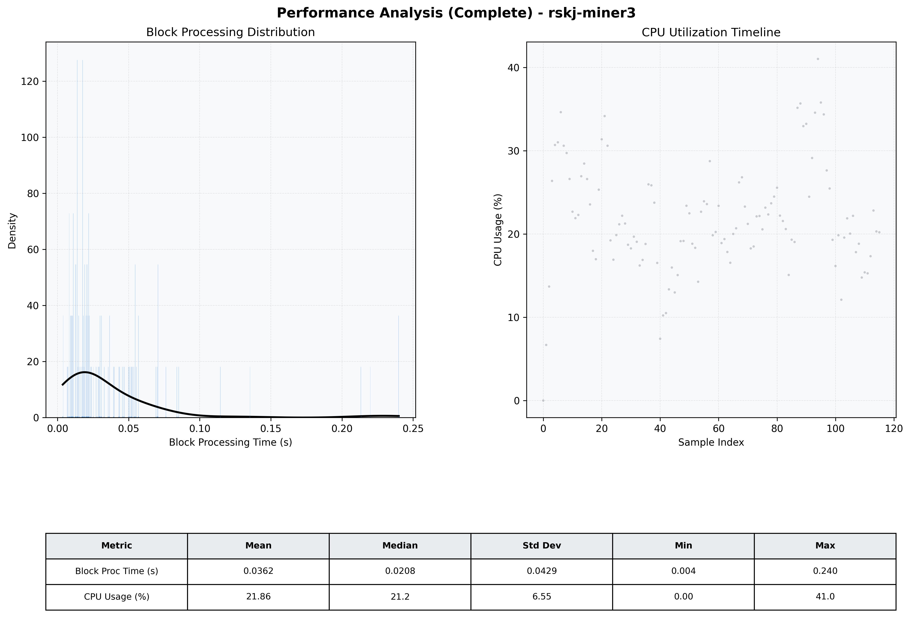

# Miner3 Quantitative Performance Report

| Category | Metric | Unit | Mean | Median | Min | Max |
| :--- | :--- | :--- | :--- | :--- | :--- | :--- |
| Processing | Block Processing Time | s | 0.036 | 0.021 | 0.004 | 0.240 |
|  | BlockExecution JMX | s | 0.023 | 0.013 | 0.004 | 0.135 |
| | Gas Consumed (per block) | M units | 4.27 | 7.00 | 0.00 | 7.00 |
| Resources | CPU Usage per Container | % | 21.86 | 21.19 | 0.00 | 41.03 |
|  | Memory Usage per Container | MiB | 2410.8 | 2485.4 | 601.3 | 2584.8 |
| JVM | JVM Heap Used | MiB | 922.4 | 916.5 | 38.2 | 1890.9 |
| | JVM Heap Allocated | MiB | 3072.0 | 3072.0 | 3072.0 | 3072.0 |
| JVM GC | GC Copy Time | s | N/A | N/A | N/A | N/A |
| JVM GC | GC MarkSweep Time | s | N/A | N/A | N/A | N/A |
| Disk I/O | Disk Read | MiB/s | 0.000 | 0.000 | 0.000 | 0.000 |
|  | Disk Write | MiB/s | 11.040 | 5.448 | 0.000 | 546.759 |
| Network | Received Network Traffic per Container | KiB/s | 2.58 | 1.87 | 0.00 | 11.60 |
|  | Sent Network Traffic per Container | KiB/s | 10.60 | 10.03 | 0.00 | 18.49 |

