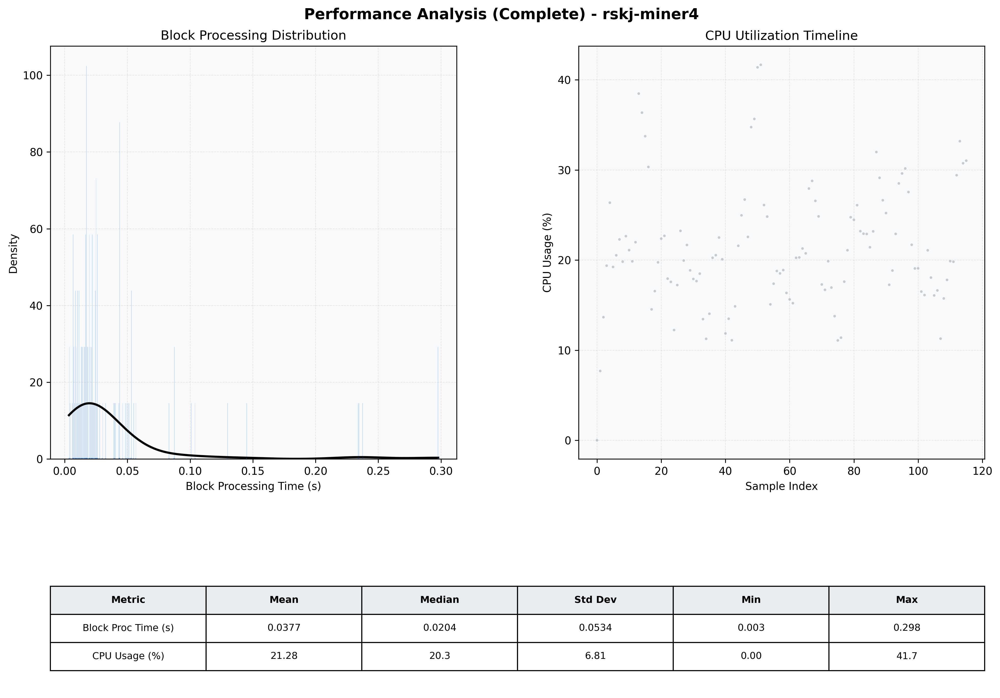

# Miner4 Quantitative Performance Report

| Category | Metric | Unit | Mean | Median | Min | Max |
| :--- | :--- | :--- | :--- | :--- | :--- | :--- |
| Processing | Block Processing Time | s | 0.038 | 0.020 | 0.003 | 0.298 |
|  | BlockExecution JMX | s | 0.023 | 0.012 | 0.002 | 0.184 |
| | Gas Consumed (per block) | M units | 4.27 | 7.00 | 0.00 | 7.00 |
| Resources | CPU Usage per Container | % | 21.28 | 20.25 | 0.00 | 41.68 |
|  | Memory Usage per Container | MiB | 1301.2 | 1314.0 | 632.0 | 1335.9 |
| JVM | JVM Heap Used | MiB | 441.1 | 440.2 | 35.7 | 828.3 |
| | JVM Heap Allocated | MiB | 2969.6 | 2969.6 | 2969.6 | 2969.6 |
| JVM GC | GC Copy Time | s | 0.0002 | 0.0002 | 0.000 | 0.001 |
| JVM GC | GC MarkSweep Time | s | 0.0000 | 0.0000 | 0.000 | 0.001 |
| Disk I/O | Disk Read | MiB/s | 0.000 | 0.000 | 0.000 | 0.000 |
|  | Disk Write | MiB/s | 10.958 | 5.379 | 0.000 | 546.897 |
| Network | Received Network Traffic per Container | KiB/s | 2.58 | 1.86 | 0.00 | 11.83 |
|  | Sent Network Traffic per Container | KiB/s | 11.10 | 10.57 | 0.00 | 18.23 |

