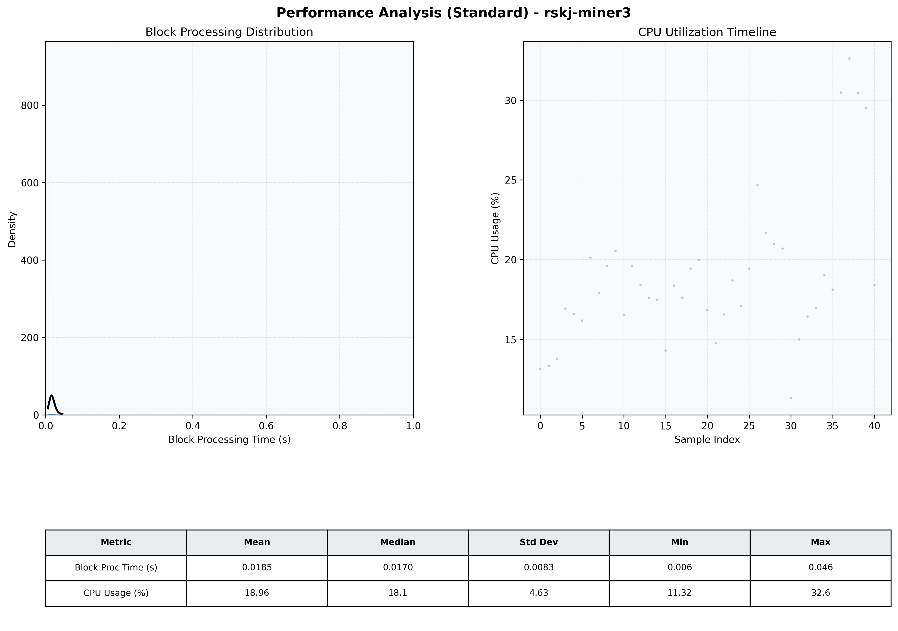

# Miner3 Quantitative Performance Report

| Category | Metric | Unit | Mean | Median | Min | Max |
| :--- | :--- | :--- | :--- | :--- | :--- | :--- |
| Processing | Block Processing Time | s | 0.018 | 0.017 | 0.006 | 0.046 |
|  | BlockExecution JMX | s | 0.012 | 0.013 | 0.004 | 0.030 |
| | Gas Consumed (per block) | M units | 6.12 | 7.00 | 0.00 | 7.00 |
| Resources | CPU Usage per Container | % | 18.96 | 18.12 | 11.32 | 32.61 |
|  | Memory Usage per Container | MiB | 2614.7 | 2614.7 | 2610.5 | 2619.1 |
| JVM | JVM Heap Used | MiB | 963.6 | 959.7 | 57.7 | 1867.7 |
| | JVM Heap Allocated | MiB | 3072.0 | 3072.0 | 3072.0 | 3072.0 |
| JVM GC | GC Copy Time | s | N/A | N/A | N/A | N/A |
| JVM GC | GC MarkSweep Time | s | N/A | N/A | N/A | N/A |
| Disk I/O | Disk Read | MiB/s | 0.000 | 0.000 | 0.000 | 0.000 |
|  | Disk Write | MiB/s | 6.927 | 5.103 | 0.552 | 30.898 |
| Network | Received Network Traffic per Container | KiB/s | 2.29 | 1.79 | 1.21 | 6.13 |
|  | Sent Network Traffic per Container | KiB/s | 10.34 | 9.87 | 9.42 | 13.45 |

