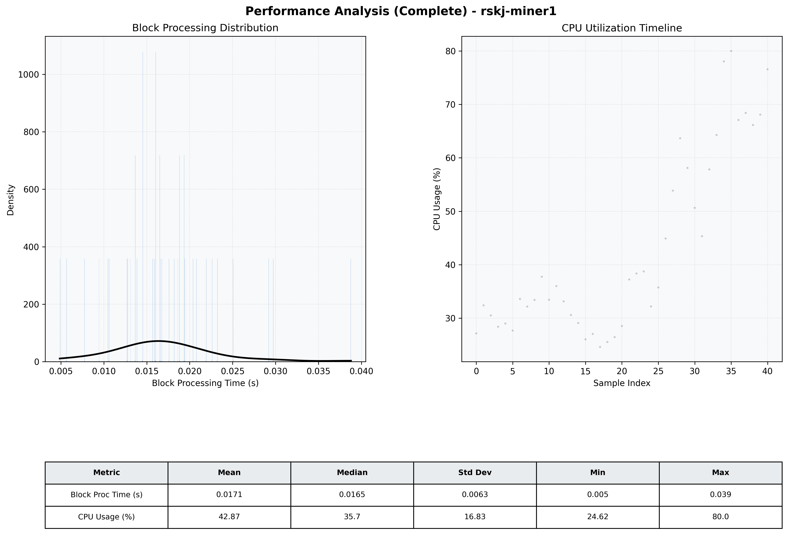

# Miner1 Quantitative Performance Report

| Category | Metric | Unit | Mean | Median | Min | Max |
| :--- | :--- | :--- | :--- | :--- | :--- | :--- |
| Processing | Block Processing Time | s | 0.017 | 0.017 | 0.005 | 0.039 |
|  | BlockExecution JMX | s | 0.013 | 0.012 | 0.006 | 0.035 |
| | Gas Consumed (per block) | M units | 6.12 | 7.00 | 0.00 | 7.00 |
| Resources | CPU Usage per Container | % | 42.87 | 35.74 | 24.62 | 79.97 |
|  | Memory Usage per Container | MiB | 1419.5 | 1413.6 | 1380.0 | 1473.5 |
| JVM | JVM Heap Used | MiB | 452.6 | 486.7 | 43.3 | 818.1 |
| | JVM Heap Allocated | MiB | 2969.6 | 2969.6 | 2969.6 | 2969.6 |
| JVM GC | GC Copy Time | s | 0.0004 | 0.0003 | 0.000 | 0.001 |
| JVM GC | GC MarkSweep Time | s | 0.0000 | 0.0000 | 0.000 | 0.000 |
| Disk I/O | Disk Read | MiB/s | 0.000 | 0.000 | 0.000 | 0.000 |
|  | Disk Write | MiB/s | 116.223 | 87.583 | 16.000 | 358.081 |
| Network | Received Network Traffic per Container | KiB/s | 23.58 | 19.10 | 8.93 | 58.42 |
|  | Sent Network Traffic per Container | KiB/s | 30.03 | 26.21 | 17.76 | 58.13 |

