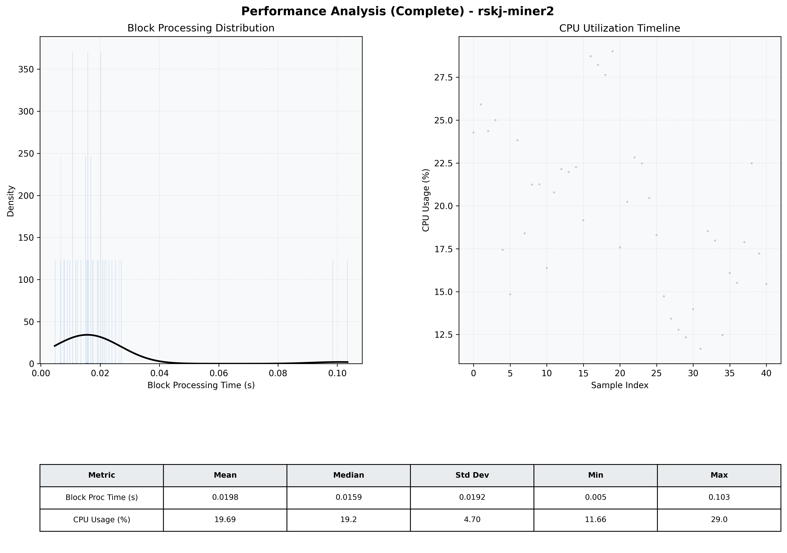

# Miner2 Quantitative Performance Report

| Category | Metric | Unit | Mean | Median | Min | Max |
| :--- | :--- | :--- | :--- | :--- | :--- | :--- |
| Processing | Block Processing Time | s | 0.020 | 0.016 | 0.005 | 0.103 |
|  | BlockExecution JMX | s | 0.013 | 0.011 | 0.002 | 0.084 |
| | Gas Consumed (per block) | M units | 6.12 | 7.00 | 0.00 | 7.00 |
| Resources | CPU Usage per Container | % | 19.69 | 19.16 | 11.66 | 29.01 |
|  | Memory Usage per Container | MiB | 1361.9 | 1361.9 | 1358.7 | 1366.0 |
| JVM | JVM Heap Used | MiB | 433.6 | 444.8 | 33.8 | 836.9 |
| | JVM Heap Allocated | MiB | 2969.6 | 2969.6 | 2969.6 | 2969.6 |
| JVM GC | GC Copy Time | s | 0.0002 | 0.0002 | 0.000 | 0.000 |
| JVM GC | GC MarkSweep Time | s | 0.0000 | 0.0000 | 0.000 | 0.000 |
| Disk I/O | Disk Read | MiB/s | 0.000 | 0.000 | 0.000 | 0.000 |
|  | Disk Write | MiB/s | 6.257 | 5.242 | 0.552 | 13.517 |
| Network | Received Network Traffic per Container | KiB/s | 2.28 | 1.78 | 1.23 | 6.05 |
|  | Sent Network Traffic per Container | KiB/s | 10.93 | 10.50 | 9.50 | 14.67 |

