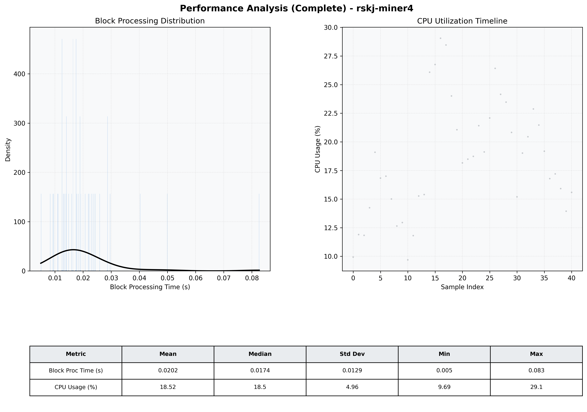

# Miner4 Quantitative Performance Report

| Category | Metric | Unit | Mean | Median | Min | Max |
| :--- | :--- | :--- | :--- | :--- | :--- | :--- |
| Processing | Block Processing Time | s | 0.020 | 0.017 | 0.005 | 0.083 |
|  | BlockExecution JMX | s | 0.013 | 0.012 | 0.003 | 0.062 |
| | Gas Consumed (per block) | M units | 6.12 | 7.00 | 0.00 | 7.00 |
| Resources | CPU Usage per Container | % | 18.52 | 18.49 | 9.69 | 29.05 |
|  | Memory Usage per Container | MiB | 1355.3 | 1355.2 | 1351.7 | 1363.1 |
| JVM | JVM Heap Used | MiB | 457.9 | 430.7 | 51.0 | 837.5 |
| | JVM Heap Allocated | MiB | 2969.6 | 2969.6 | 2969.6 | 2969.6 |
| JVM GC | GC Copy Time | s | 0.0001 | 0.0002 | 0.000 | 0.000 |
| JVM GC | GC MarkSweep Time | s | 0.0000 | 0.0000 | 0.000 | 0.000 |
| Disk I/O | Disk Read | MiB/s | 0.000 | 0.000 | 0.000 | 0.000 |
|  | Disk Write | MiB/s | 6.974 | 4.966 | 0.552 | 30.898 |
| Network | Received Network Traffic per Container | KiB/s | 2.25 | 1.76 | 1.16 | 5.99 |
|  | Sent Network Traffic per Container | KiB/s | 10.97 | 10.65 | 9.98 | 14.12 |

