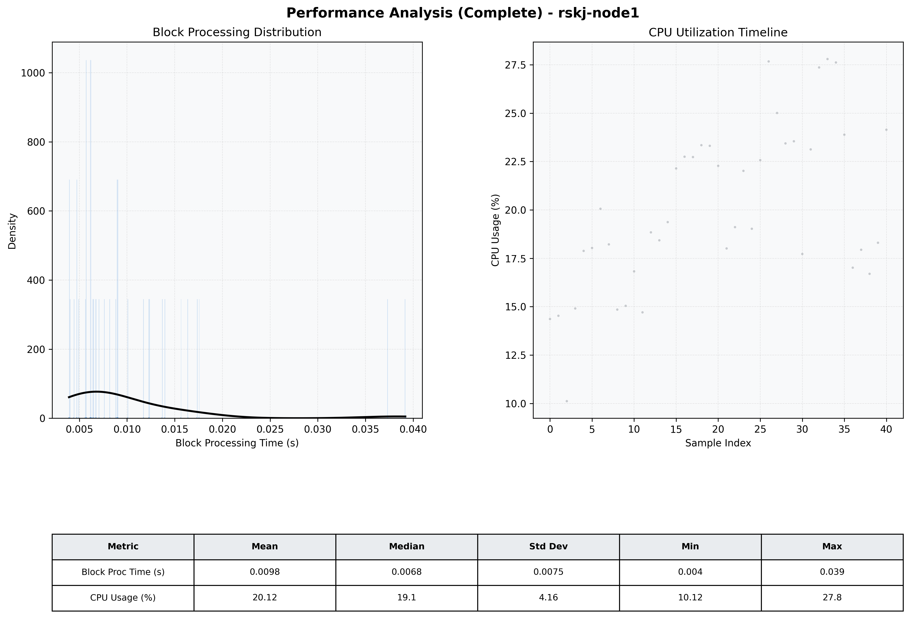

# Node1 Quantitative Performance Report

| Category | Metric | Unit | Mean | Median | Min | Max |
| :--- | :--- | :--- | :--- | :--- | :--- | :--- |
| Processing | Block Processing Time | s | 0.010 | 0.007 | 0.004 | 0.039 |
|  | BlockExecution JMX | s | 0.006 | 0.004 | 0.003 | 0.026 |
| | Gas Consumed (per block) | M units | 6.12 | 7.00 | 0.00 | 7.00 |
| Resources | CPU Usage per Container | % | 20.12 | 19.11 | 10.12 | 27.80 |
|  | Memory Usage per Container | MiB | 1354.0 | 1354.9 | 1351.1 | 1356.3 |
| JVM | JVM Heap Used | MiB | 444.5 | 462.1 | 57.9 | 814.3 |
| | JVM Heap Allocated | MiB | 2969.6 | 2969.6 | 2969.6 | 2969.6 |
| JVM GC | GC Copy Time | s | 0.0002 | 0.0002 | 0.000 | 0.000 |
| JVM GC | GC MarkSweep Time | s | 0.0000 | 0.0000 | 0.000 | 0.000 |
| Disk I/O | Disk Read | MiB/s | 0.000 | 0.000 | 0.000 | 0.000 |
|  | Disk Write | MiB/s | 3.031 | 2.345 | 0.552 | 21.379 |
| Network | Received Network Traffic per Container | KiB/s | 2.28 | 1.82 | 1.20 | 6.09 |
|  | Sent Network Traffic per Container | KiB/s | 10.82 | 10.41 | 9.94 | 14.02 |

