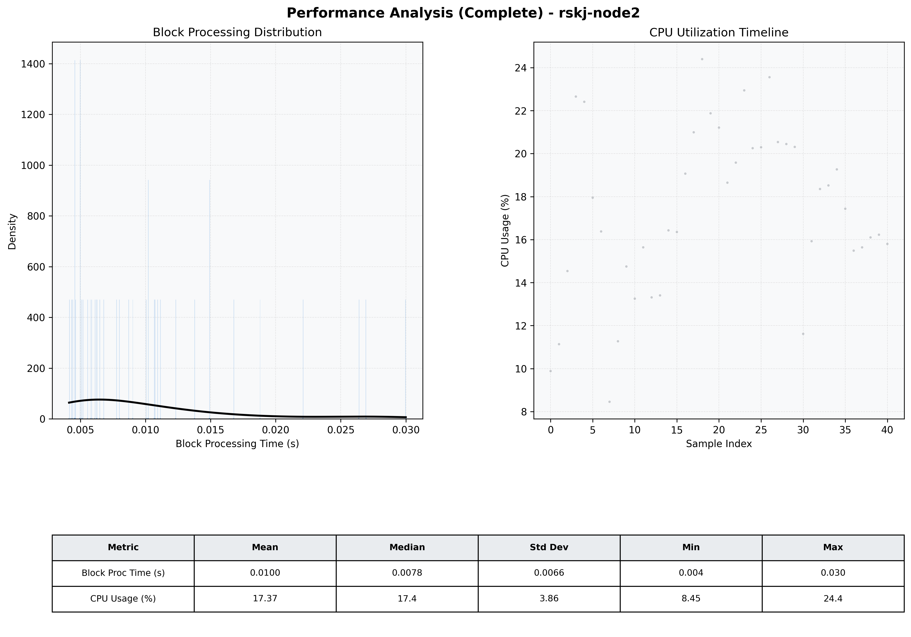

# Node2 Quantitative Performance Report

| Category | Metric | Unit | Mean | Median | Min | Max |
| :--- | :--- | :--- | :--- | :--- | :--- | :--- |
| Processing | Block Processing Time | s | 0.010 | 0.008 | 0.004 | 0.030 |
|  | BlockExecution JMX | s | 0.007 | 0.005 | 0.003 | 0.024 |
| | Gas Consumed (per block) | M units | 6.12 | 7.00 | 0.00 | 7.00 |
| Resources | CPU Usage per Container | % | 17.37 | 17.43 | 8.45 | 24.40 |
|  | Memory Usage per Container | MiB | 2562.0 | 2561.9 | 2560.9 | 2563.4 |
| JVM | JVM Heap Used | MiB | 937.9 | 917.0 | 33.0 | 1838.0 |
| | JVM Heap Allocated | MiB | 3072.0 | 3072.0 | 3072.0 | 3072.0 |
| JVM GC | GC Copy Time | s | N/A | N/A | N/A | N/A |
| JVM GC | GC MarkSweep Time | s | N/A | N/A | N/A | N/A |
| Disk I/O | Disk Read | MiB/s | 0.000 | 0.000 | 0.000 | 0.000 |
|  | Disk Write | MiB/s | 2.331 | 2.345 | 0.552 | 4.828 |
| Network | Received Network Traffic per Container | KiB/s | 2.29 | 1.81 | 1.20 | 6.13 |
|  | Sent Network Traffic per Container | KiB/s | 10.19 | 9.80 | 9.10 | 13.51 |

