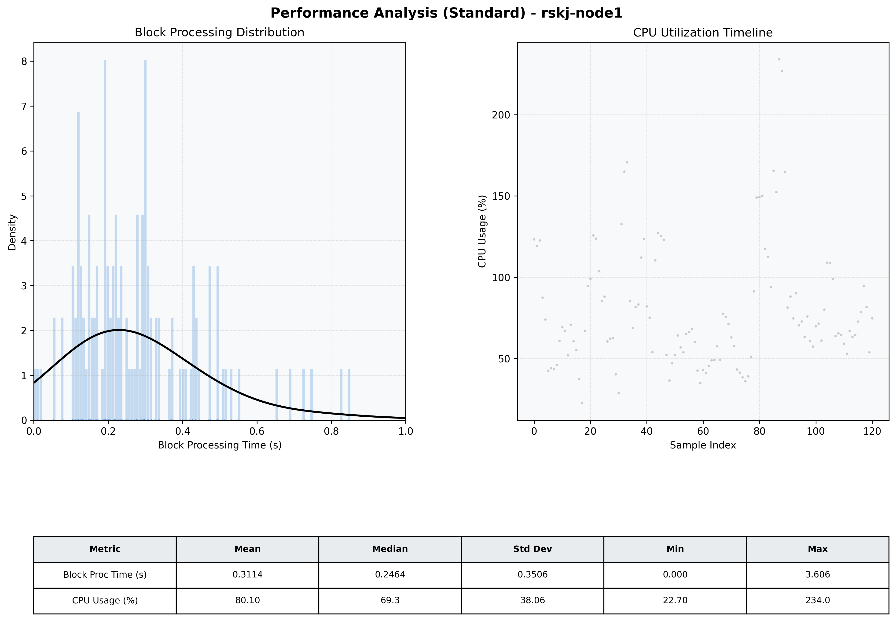

# Node1 Quantitative Performance Report

| Category | Metric | Unit | Mean | Median | Min | Max |
| :--- | :--- | :--- | :--- | :--- | :--- | :--- |
| Processing | Block Processing Time | s | 0.311 | 0.246 | 0.000 | 3.606 |
|  | BlockExecution JMX | s | 0.182 | 0.141 | 0.004 | 0.728 |
| | Gas Consumed (per block) | M units | 8.43 | 9.38 | 0.06 | 9.92 |
| Resources | CPU Usage per Container | % | 80.10 | 69.28 | 22.70 | 234.02 |
|  | Memory Usage per Container | MiB | 3759.6 | 3772.8 | 3601.9 | 3944.7 |
| | CPU & Memory Assigned | - | 1.0 CPU, 4G | - | - | - |
| JVM | JVM Heap Used | MiB | 2023.9 | 2033.1 | 1510.8 | 2515.7 |
| | JVM Heap Allocated | MiB | 2969.6 | 2969.6 | 2969.6 | 2969.6 |
| JVM GC | GC Copy Time | s | 0.0071 | 0.0057 | 0.001 | 0.046 |
| JVM GC | GC MarkSweep Time | s | 0.0000 | 0.0000 | 0.000 | 0.000 |
| Disk I/O | Disk Read | MiB/s | 0.002 | 0.000 | 0.000 | 0.138 |
|  | Disk Write | MiB/s | 157.524 | 17.655 | 0.000 | 7429.852 |
| Network | Received Network Traffic per Container | KiB/s | 105.97 | 91.16 | 0.81 | 369.22 |
|  | Sent Network Traffic per Container | KiB/s | 104.88 | 88.48 | 5.20 | 350.00 |

