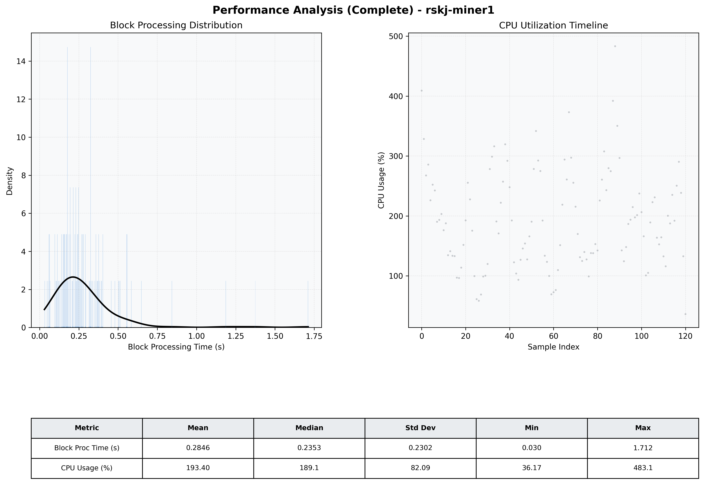

# Miner1 Quantitative Performance Report

| Category | Metric | Unit | Mean | Median | Min | Max |
| :--- | :--- | :--- | :--- | :--- | :--- | :--- |
| Processing | Block Processing Time | s | 0.285 | 0.235 | 0.030 | 1.712 |
|  | BlockExecution JMX | s | 0.145 | 0.118 | 0.015 | 0.971 |
| | Gas Consumed (per block) | M units | 8.43 | 9.38 | 0.06 | 9.92 |
| Resources | CPU Usage per Container | % | 193.40 | 189.13 | 36.17 | 483.12 |
|  | Memory Usage per Container | MiB | 4972.5 | 4977.4 | 4788.8 | 5161.2 |
| | CPU & Memory Assigned | - | 2.0 CPU, 8G | - | - | - |
| JVM | JVM Heap Used | MiB | 1805.6 | 1828.1 | 822.3 | 2681.6 |
| | JVM Heap Allocated | MiB | 3072.0 | 3072.0 | 3072.0 | 3072.0 |
| JVM GC | GC Copy Time | s | N/A | N/A | N/A | N/A |
| JVM GC | GC MarkSweep Time | s | N/A | N/A | N/A | N/A |
| Disk I/O | Disk Read | MiB/s | 0.002 | 0.000 | 0.000 | 0.138 |
|  | Disk Write | MiB/s | 398.217 | 269.241 | 0.000 | 8026.894 |
| Network | Received Network Traffic per Container | KiB/s | 101.84 | 87.71 | 1.13 | 367.76 |
|  | Sent Network Traffic per Container | KiB/s | 122.31 | 98.50 | 5.47 | 519.16 |

