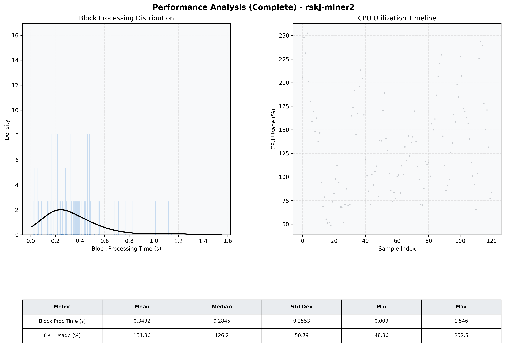

# Miner2 Quantitative Performance Report

| Category | Metric | Unit | Mean | Median | Min | Max |
| :--- | :--- | :--- | :--- | :--- | :--- | :--- |
| Processing | Block Processing Time | s | 0.349 | 0.284 | 0.009 | 1.546 |
|  | BlockExecution JMX | s | 0.166 | 0.133 | 0.016 | 0.960 |
| | Gas Consumed (per block) | M units | 8.43 | 9.38 | 0.06 | 9.92 |
| Resources | CPU Usage per Container | % | 131.86 | 126.20 | 48.86 | 252.47 |
|  | Memory Usage per Container | MiB | 3910.5 | 3916.9 | 3666.7 | 4095.6 |
| | CPU & Memory Assigned | - | 1.0 CPU, 4G | - | - | - |
| JVM | JVM Heap Used | MiB | 1815.5 | 1793.9 | 1315.0 | 2404.1 |
| | JVM Heap Allocated | MiB | 2969.6 | 2969.6 | 2969.6 | 2969.6 |
| JVM GC | GC Copy Time | s | 0.0116 | 0.0093 | 0.001 | 0.043 |
| JVM GC | GC MarkSweep Time | s | 0.0000 | 0.0000 | 0.000 | 0.000 |
| Disk I/O | Disk Read | MiB/s | 0.040 | 0.000 | 0.000 | 4.689 |
|  | Disk Write | MiB/s | 235.938 | 118.905 | 0.000 | 7513.016 |
| Network | Received Network Traffic per Container | KiB/s | 100.58 | 82.76 | 0.83 | 399.32 |
|  | Sent Network Traffic per Container | KiB/s | 94.15 | 82.50 | 5.53 | 365.56 |

