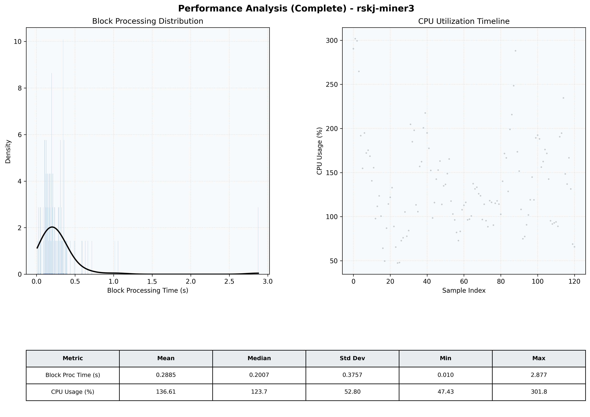

# Miner3 Quantitative Performance Report

| Category | Metric | Unit | Mean | Median | Min | Max |
| :--- | :--- | :--- | :--- | :--- | :--- | :--- |
| Processing | Block Processing Time | s | 0.288 | 0.201 | 0.010 | 2.877 |
|  | BlockExecution JMX | s | 0.177 | 0.116 | 0.012 | 2.641 |
| | Gas Consumed (per block) | M units | 8.43 | 9.38 | 0.06 | 9.92 |
| Resources | CPU Usage per Container | % | 136.61 | 123.69 | 47.43 | 301.80 |
|  | Memory Usage per Container | MiB | 4049.3 | 4046.1 | 3993.2 | 4095.9 |
| | CPU & Memory Assigned | - | 2.0 CPU, 4G | - | - | - |
| JVM | JVM Heap Used | MiB | 1817.4 | 1827.4 | 899.2 | 2679.7 |
| | JVM Heap Allocated | MiB | 3072.0 | 3072.0 | 3072.0 | 3072.0 |
| JVM GC | GC Copy Time | s | N/A | N/A | N/A | N/A |
| JVM GC | GC MarkSweep Time | s | N/A | N/A | N/A | N/A |
| Disk I/O | Disk Read | MiB/s | 111.151 | 25.510 | 0.000 | 4078.899 |
|  | Disk Write | MiB/s | 214.495 | 116.487 | 0.000 | 5864.202 |
| Network | Received Network Traffic per Container | KiB/s | 100.81 | 82.44 | 0.80 | 387.80 |
|  | Sent Network Traffic per Container | KiB/s | 95.66 | 80.13 | 5.28 | 308.72 |

