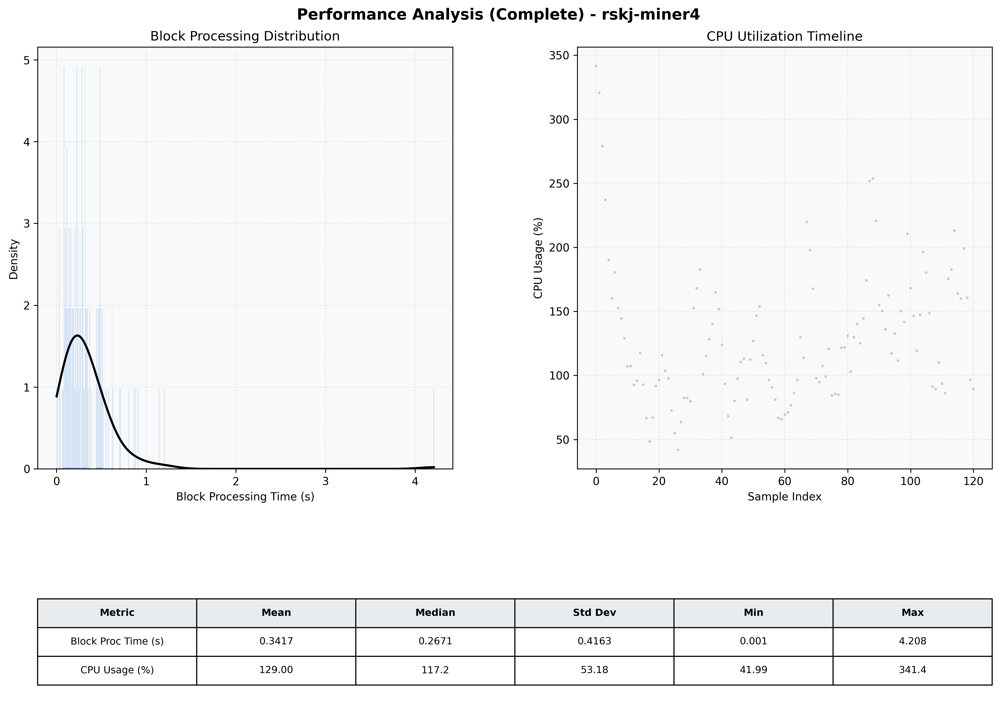

# Miner4 Quantitative Performance Report

| Category | Metric | Unit | Mean | Median | Min | Max |
| :--- | :--- | :--- | :--- | :--- | :--- | :--- |
| Processing | Block Processing Time | s | 0.342 | 0.267 | 0.001 | 4.208 |
|  | BlockExecution JMX | s | 0.239 | 0.141 | 0.016 | 3.895 |
| | Gas Consumed (per block) | M units | 8.43 | 9.38 | 0.06 | 9.92 |
| Resources | CPU Usage per Container | % | 129.00 | 117.16 | 41.99 | 341.43 |
|  | Memory Usage per Container | MiB | 4027.7 | 4036.5 | 3878.4 | 4095.5 |
| | CPU & Memory Assigned | - | 1.0 CPU, 4G | - | - | - |
| JVM | JVM Heap Used | MiB | 1192.5 | 1175.5 | 710.1 | 1781.0 |
| | JVM Heap Allocated | MiB | 2969.6 | 2969.6 | 2969.6 | 2969.6 |
| JVM GC | GC Copy Time | s | 0.0096 | 0.0078 | 0.000 | 0.047 |
| JVM GC | GC MarkSweep Time | s | 0.0000 | 0.0000 | 0.000 | 0.000 |
| Disk I/O | Disk Read | MiB/s | 94.345 | 5.931 | 0.000 | 4339.689 |
|  | Disk Write | MiB/s | 281.033 | 112.962 | 0.000 | 7519.498 |
| Network | Received Network Traffic per Container | KiB/s | 97.90 | 89.67 | 0.79 | 309.95 |
|  | Sent Network Traffic per Container | KiB/s | 93.58 | 85.16 | 5.22 | 397.26 |

