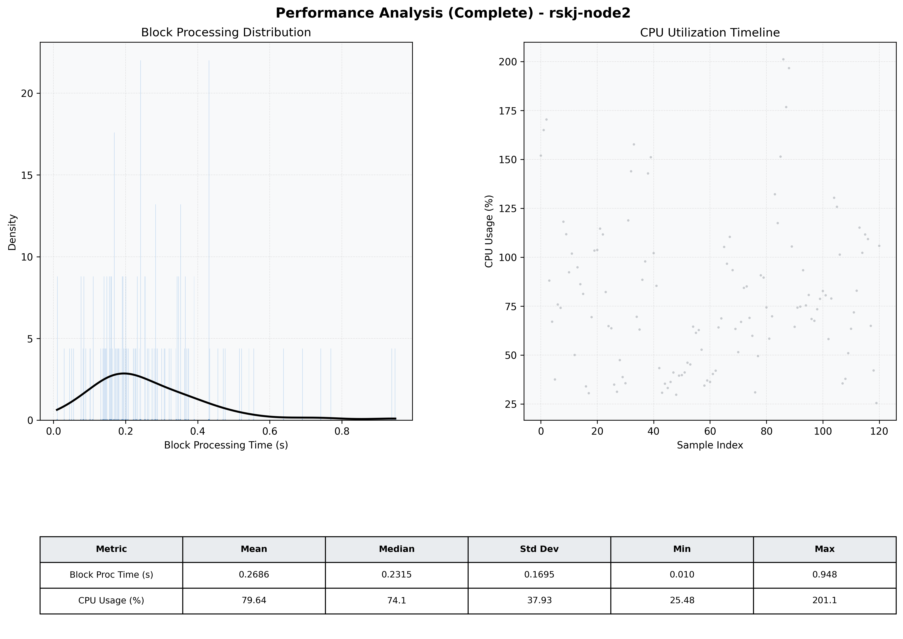

# Node2 Quantitative Performance Report

| Category | Metric | Unit | Mean | Median | Min | Max |
| :--- | :--- | :--- | :--- | :--- | :--- | :--- |
| Processing | Block Processing Time | s | 0.269 | 0.231 | 0.010 | 0.948 |
|  | BlockExecution JMX | s | 0.201 | 0.174 | 0.004 | 0.837 |
| | Gas Consumed (per block) | M units | 8.43 | 9.38 | 0.06 | 9.92 |
| Resources | CPU Usage per Container | % | 79.64 | 74.11 | 25.48 | 201.14 |
|  | Memory Usage per Container | MiB | 4056.0 | 4057.9 | 3994.9 | 4095.3 |
| | CPU & Memory Assigned | - | 2.0 CPU, 4G | - | - | - |
| JVM | JVM Heap Used | MiB | 1470.9 | 1405.8 | 882.6 | 2515.4 |
| | JVM Heap Allocated | MiB | 3072.0 | 3072.0 | 3072.0 | 3072.0 |
| JVM GC | GC Copy Time | s | N/A | N/A | N/A | N/A |
| JVM GC | GC MarkSweep Time | s | N/A | N/A | N/A | N/A |
| Disk I/O | Disk Read | MiB/s | 71.609 | 7.862 | 0.000 | 3634.658 |
|  | Disk Write | MiB/s | 84.864 | 16.826 | 0.000 | 5146.502 |
| Network | Received Network Traffic per Container | KiB/s | 121.67 | 108.76 | 0.80 | 445.78 |
|  | Sent Network Traffic per Container | KiB/s | 102.63 | 87.22 | 4.95 | 375.65 |

