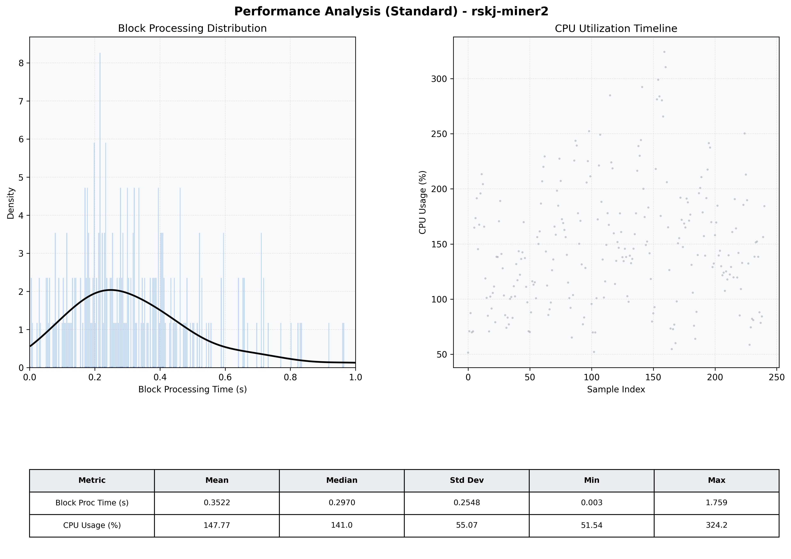

# Miner2 Quantitative Performance Report

| Category | Metric | Unit | Mean | Median | Min | Max |
| :--- | :--- | :--- | :--- | :--- | :--- | :--- |
| Processing | Block Processing Time | s | 0.352 | 0.297 | 0.003 | 1.759 |
|  | BlockExecution JMX | s | 0.171 | 0.133 | 0.016 | 0.889 |
| | Gas Consumed (per block) | M units | 8.47 | 9.27 | 0.06 | 9.97 |
| Resources | CPU Usage per Container | % | 147.77 | 140.99 | 51.54 | 324.19 |
|  | Memory Usage per Container | MiB | 4008.2 | 4027.3 | 3793.1 | 4095.8 |
| | CPU & Memory Assigned | - | 1.0 CPU, 4G | - | - | - |
| JVM | JVM Heap Used | MiB | 1935.4 | 1946.7 | 1002.7 | 2829.1 |
| | JVM Heap Allocated | MiB | 2969.6 | 2969.6 | 2969.6 | 2969.6 |
| JVM GC | GC Copy Time | s | 0.0121 | 0.0102 | 0.001 | 0.052 |
| JVM GC | GC MarkSweep Time | s | 0.0024 | 0.0000 | 0.000 | 0.586 |
| Disk I/O | Disk Read | MiB/s | 117.743 | 0.000 | 0.000 | 5464.777 |
|  | Disk Write | MiB/s | 350.855 | 194.897 | 0.000 | 7513.016 |
| Network | Received Network Traffic per Container | KiB/s | 118.98 | 105.96 | 0.83 | 422.72 |
|  | Sent Network Traffic per Container | KiB/s | 123.75 | 108.94 | 1.02 | 486.01 |

