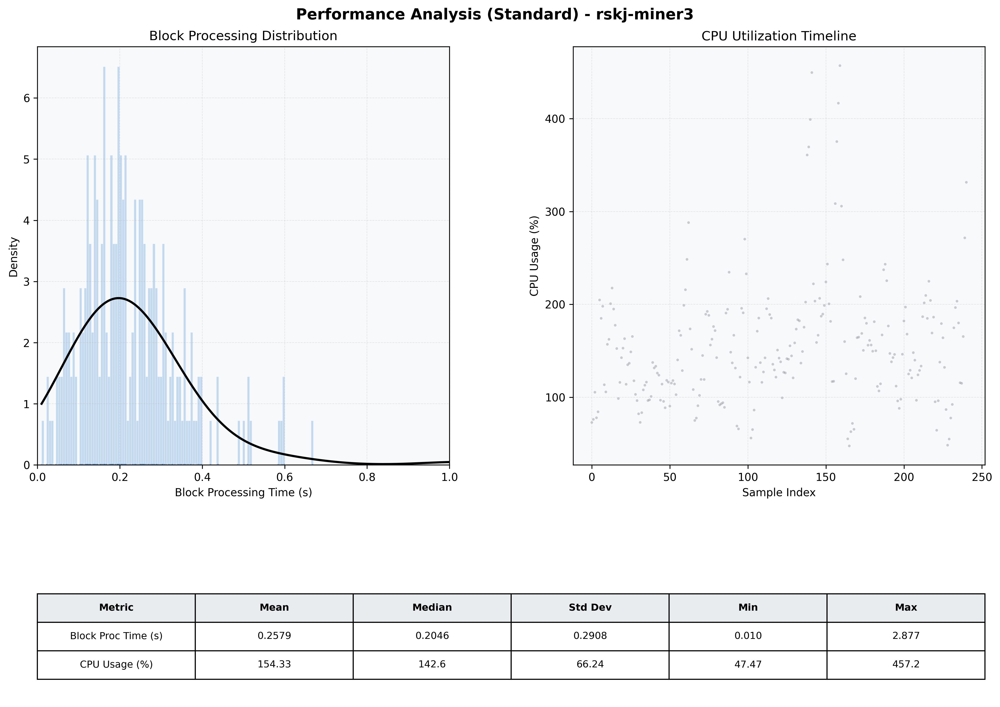

# Miner3 Quantitative Performance Report

| Category | Metric | Unit | Mean | Median | Min | Max |
| :--- | :--- | :--- | :--- | :--- | :--- | :--- |
| Processing | Block Processing Time | s | 0.258 | 0.205 | 0.010 | 2.877 |
|  | BlockExecution JMX | s | 0.135 | 0.115 | 0.023 | 0.625 |
| | Gas Consumed (per block) | M units | 8.47 | 9.27 | 0.06 | 9.97 |
| Resources | CPU Usage per Container | % | 154.33 | 142.64 | 47.47 | 457.21 |
|  | Memory Usage per Container | MiB | 4059.5 | 4066.4 | 3993.2 | 4096.0 |
| | CPU & Memory Assigned | - | 2.0 CPU, 4G | - | - | - |
| JVM | JVM Heap Used | MiB | 1892.1 | 1893.7 | 936.2 | 2722.6 |
| | JVM Heap Allocated | MiB | 3072.0 | 3072.0 | 3072.0 | 3072.0 |
| JVM GC | GC Copy Time | s | N/A | N/A | N/A | N/A |
| JVM GC | GC MarkSweep Time | s | N/A | N/A | N/A | N/A |
| Disk I/O | Disk Read | MiB/s | 309.061 | 54.891 | 0.000 | 6776.870 |
|  | Disk Write | MiB/s | 451.914 | 255.422 | 0.000 | 8280.266 |
| Network | Received Network Traffic per Container | KiB/s | 121.94 | 111.06 | 0.80 | 381.54 |
|  | Sent Network Traffic per Container | KiB/s | 130.62 | 122.39 | 5.28 | 417.11 |

