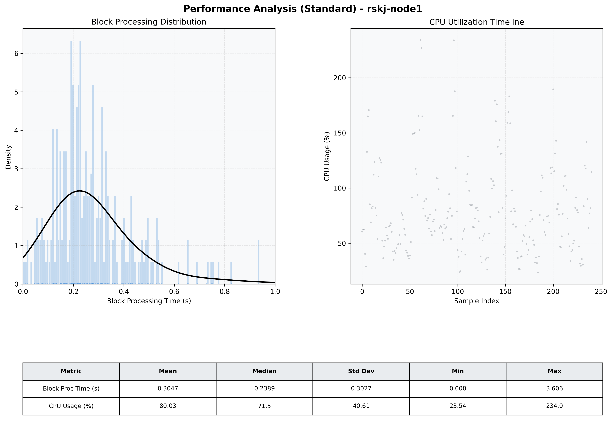

# Node1 Quantitative Performance Report

| Category | Metric | Unit | Mean | Median | Min | Max |
| :--- | :--- | :--- | :--- | :--- | :--- | :--- |
| Processing | Block Processing Time | s | 0.305 | 0.239 | 0.000 | 3.606 |
|  | BlockExecution JMX | s | 0.175 | 0.145 | 0.004 | 0.877 |
| | Gas Consumed (per block) | M units | 8.47 | 9.27 | 0.06 | 9.97 |
| Resources | CPU Usage per Container | % | 80.03 | 71.51 | 23.54 | 234.02 |
|  | Memory Usage per Container | MiB | 3867.3 | 3892.1 | 3582.5 | 4096.0 |
| | CPU & Memory Assigned | - | 1.0 CPU, 4G | - | - | - |
| JVM | JVM Heap Used | MiB | 2066.2 | 2144.1 | 934.9 | 2863.4 |
| | JVM Heap Allocated | MiB | 2969.6 | 2969.6 | 2969.6 | 2969.6 |
| JVM GC | GC Copy Time | s | 0.0071 | 0.0052 | 0.000 | 0.046 |
| JVM GC | GC MarkSweep Time | s | 0.0025 | 0.0000 | 0.000 | 0.611 |
| Disk I/O | Disk Read | MiB/s | 76.742 | 0.000 | 0.000 | 6469.708 |
|  | Disk Write | MiB/s | 203.310 | 22.759 | 0.000 | 8056.964 |
| Network | Received Network Traffic per Container | KiB/s | 137.52 | 119.64 | 0.81 | 656.79 |
|  | Sent Network Traffic per Container | KiB/s | 116.34 | 102.49 | 1.18 | 410.39 |

