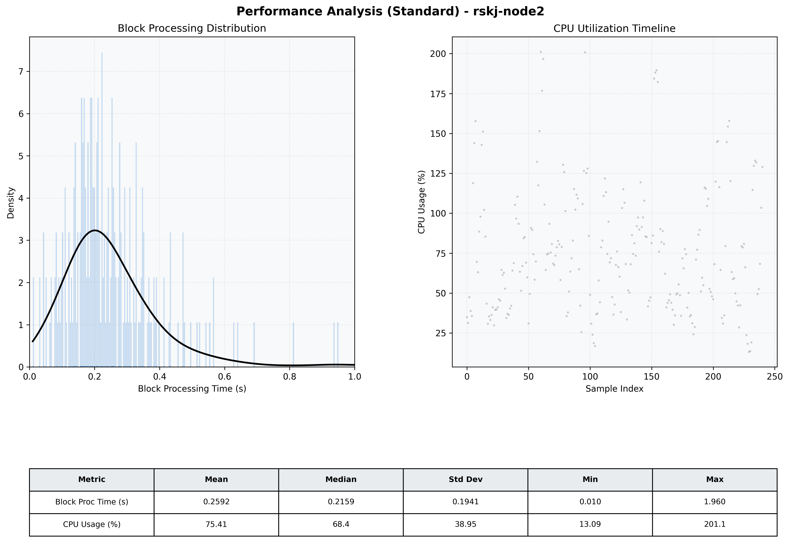

# Node2 Quantitative Performance Report

| Category | Metric | Unit | Mean | Median | Min | Max |
| :--- | :--- | :--- | :--- | :--- | :--- | :--- |
| Processing | Block Processing Time | s | 0.259 | 0.216 | 0.010 | 1.960 |
|  | BlockExecution JMX | s | 0.183 | 0.161 | 0.004 | 0.969 |
| | Gas Consumed (per block) | M units | 8.47 | 9.27 | 0.06 | 9.97 |
| Resources | CPU Usage per Container | % | 75.41 | 68.44 | 13.09 | 201.14 |
|  | Memory Usage per Container | MiB | 4054.9 | 4060.0 | 3954.5 | 4095.7 |
| | CPU & Memory Assigned | - | 2.0 CPU, 4G | - | - | - |
| JVM | JVM Heap Used | MiB | 1543.3 | 1504.2 | 948.0 | 2645.8 |
| | JVM Heap Allocated | MiB | 3072.0 | 3072.0 | 3072.0 | 3072.0 |
| JVM GC | GC Copy Time | s | N/A | N/A | N/A | N/A |
| JVM GC | GC MarkSweep Time | s | N/A | N/A | N/A | N/A |
| Disk I/O | Disk Read | MiB/s | 130.478 | 15.172 | 0.000 | 6271.172 |
|  | Disk Write | MiB/s | 215.851 | 21.519 | 0.000 | 13437.545 |
| Network | Received Network Traffic per Container | KiB/s | 141.37 | 130.01 | 0.80 | 484.68 |
|  | Sent Network Traffic per Container | KiB/s | 113.12 | 102.16 | 4.95 | 376.73 |

