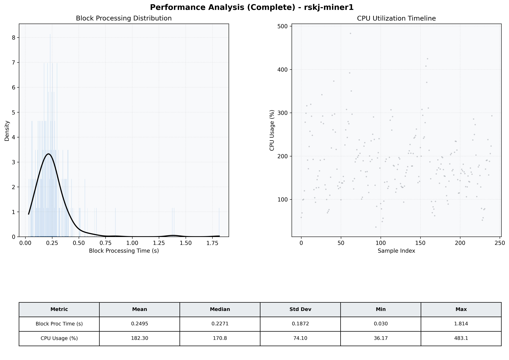

# Miner1 Quantitative Performance Report

| Category | Metric | Unit | Mean | Median | Min | Max |
| :--- | :--- | :--- | :--- | :--- | :--- | :--- |
| Processing | Block Processing Time | s | 0.249 | 0.227 | 0.030 | 1.814 |
|  | BlockExecution JMX | s | 0.130 | 0.106 | 0.020 | 0.930 |
| | Gas Consumed (per block) | M units | 8.47 | 9.27 | 0.06 | 9.97 |
| Resources | CPU Usage per Container | % | 182.30 | 170.78 | 36.17 | 483.12 |
|  | Memory Usage per Container | MiB | 5181.2 | 5160.5 | 4850.0 | 5480.7 |
| | CPU & Memory Assigned | - | 2.0 CPU, 8G | - | - | - |
| JVM | JVM Heap Used | MiB | 1847.5 | 1840.7 | 822.3 | 2721.5 |
| | JVM Heap Allocated | MiB | 3072.0 | 3072.0 | 3072.0 | 3072.0 |
| JVM GC | GC Copy Time | s | N/A | N/A | N/A | N/A |
| JVM GC | GC MarkSweep Time | s | N/A | N/A | N/A | N/A |
| Disk I/O | Disk Read | MiB/s | 0.020 | 0.000 | 0.000 | 1.241 |
|  | Disk Write | MiB/s | 392.478 | 240.292 | 0.000 | 8026.894 |
| Network | Received Network Traffic per Container | KiB/s | 121.52 | 111.60 | 1.13 | 455.23 |
|  | Sent Network Traffic per Container | KiB/s | 134.50 | 121.32 | 5.47 | 519.16 |

