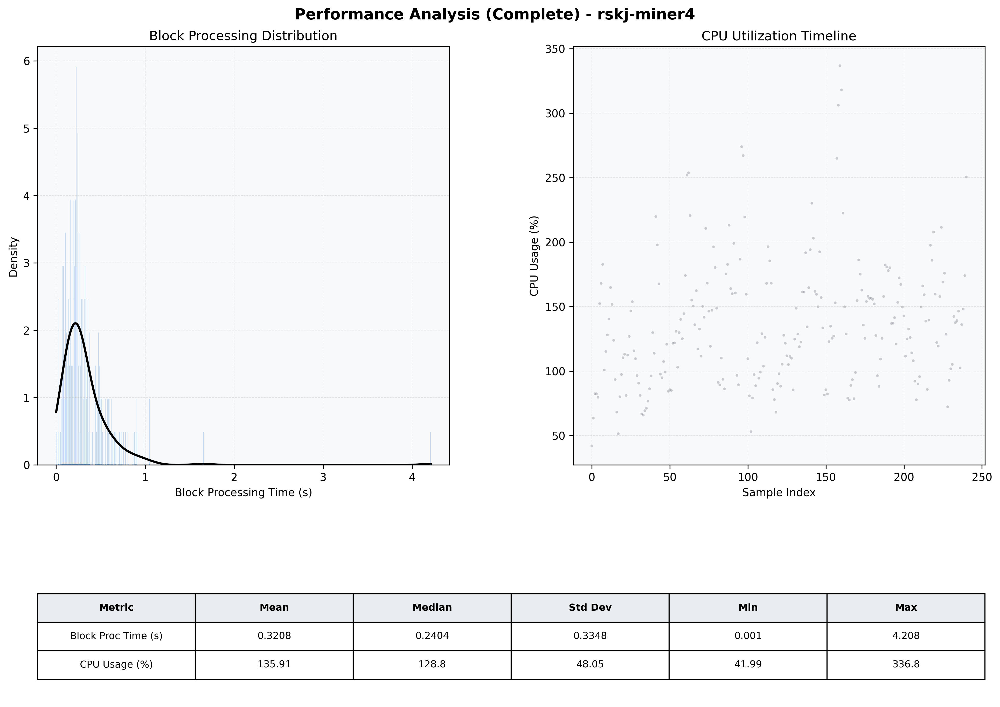

# Miner4 Quantitative Performance Report

| Category | Metric | Unit | Mean | Median | Min | Max |
| :--- | :--- | :--- | :--- | :--- | :--- | :--- |
| Processing | Block Processing Time | s | 0.321 | 0.240 | 0.001 | 4.208 |
|  | BlockExecution JMX | s | 0.210 | 0.143 | 0.016 | 3.895 |
| | Gas Consumed (per block) | M units | 8.47 | 9.27 | 0.06 | 9.97 |
| Resources | CPU Usage per Container | % | 135.91 | 128.80 | 41.99 | 336.81 |
|  | Memory Usage per Container | MiB | 3964.6 | 4000.1 | 3623.6 | 4095.6 |
| | CPU & Memory Assigned | - | 1.0 CPU, 4G | - | - | - |
| JVM | JVM Heap Used | MiB | 1495.0 | 1505.9 | 748.8 | 2300.5 |
| | JVM Heap Allocated | MiB | 2969.6 | 2969.6 | 2969.6 | 2969.6 |
| JVM GC | GC Copy Time | s | 0.0110 | 0.0096 | 0.000 | 0.047 |
| JVM GC | GC MarkSweep Time | s | 0.0000 | 0.0000 | 0.000 | 0.000 |
| Disk I/O | Disk Read | MiB/s | 144.664 | 15.982 | 0.000 | 6208.751 |
|  | Disk Write | MiB/s | 401.038 | 191.573 | 0.000 | 8380.401 |
| Network | Received Network Traffic per Container | KiB/s | 116.89 | 103.56 | 0.79 | 419.63 |
|  | Sent Network Traffic per Container | KiB/s | 124.86 | 112.63 | 5.22 | 522.86 |

