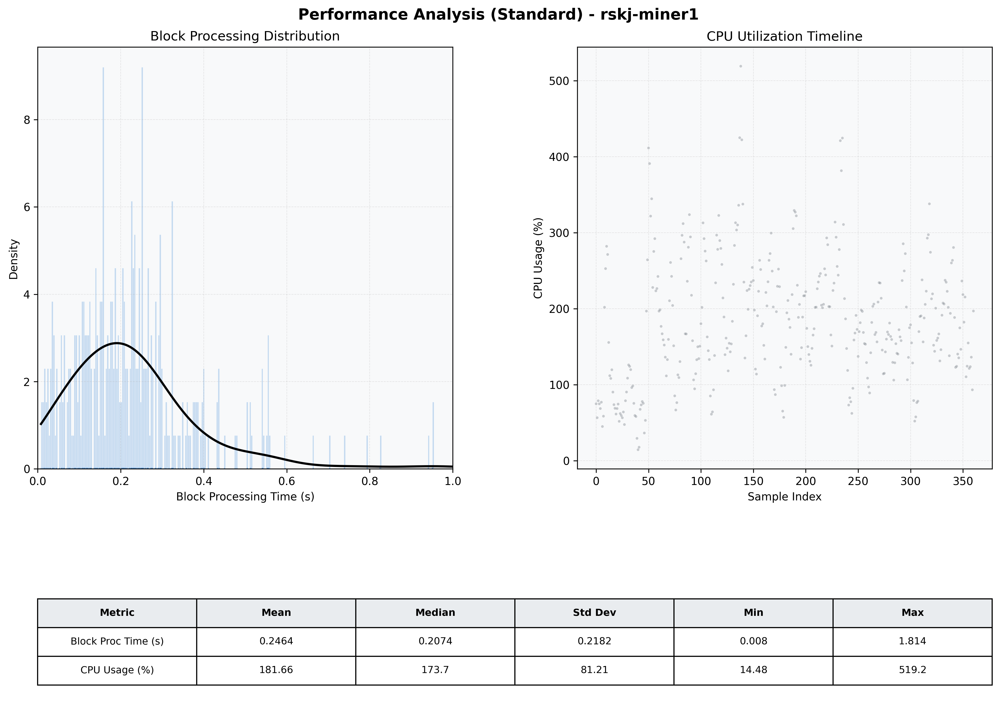

# Miner1 Quantitative Performance Report

| Category | Metric | Unit | Mean | Median | Min | Max |
| :--- | :--- | :--- | :--- | :--- | :--- | :--- |
| Processing | Block Processing Time | s | 0.246 | 0.207 | 0.008 | 1.814 |
|  | BlockExecution JMX | s | 0.135 | 0.106 | 0.004 | 0.971 |
| | Gas Consumed (per block) | M units | 8.09 | 9.23 | 0.00 | 9.97 |
| Resources | CPU Usage per Container | % | 181.66 | 173.70 | 14.48 | 519.25 |
|  | Memory Usage per Container | MiB | 5063.5 | 5087.2 | 4553.9 | 5522.4 |
| | CPU & Memory Assigned | - | 2.0 CPU, 8G | - | - | - |
| JVM | JVM Heap Used | MiB | 1874.0 | 1875.4 | 793.5 | 2715.2 |
| | JVM Heap Allocated | MiB | 3072.0 | 3072.0 | 3072.0 | 3072.0 |
| JVM GC | GC Copy Time | s | N/A | N/A | N/A | N/A |
| JVM GC | GC MarkSweep Time | s | N/A | N/A | N/A | N/A |
| Disk I/O | Disk Read | MiB/s | 11.283 | 0.000 | 0.000 | 3401.931 |
|  | Disk Write | MiB/s | 532.604 | 302.334 | 0.000 | 10593.387 |
| Network | Received Network Traffic per Container | KiB/s | 149.34 | 136.27 | 1.57 | 455.23 |
|  | Sent Network Traffic per Container | KiB/s | 162.50 | 150.64 | 9.89 | 463.90 |

