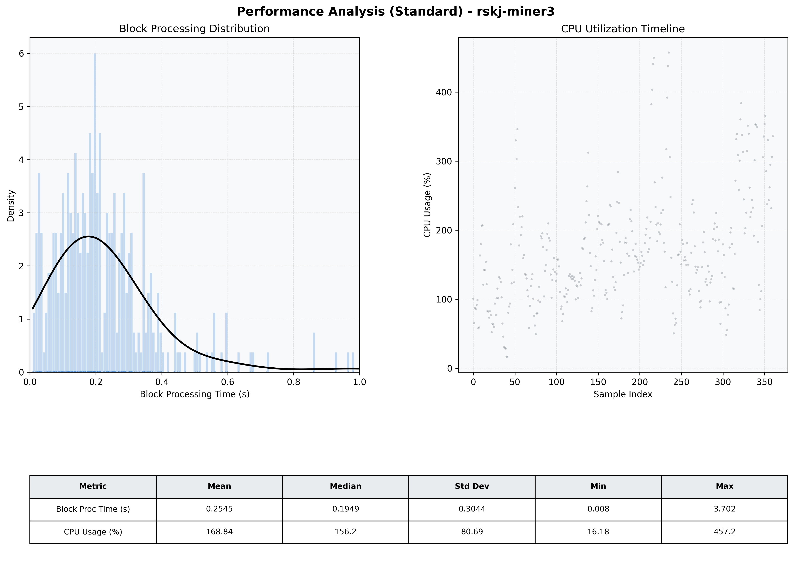

# Miner3 Quantitative Performance Report

| Category | Metric | Unit | Mean | Median | Min | Max |
| :--- | :--- | :--- | :--- | :--- | :--- | :--- |
| Processing | Block Processing Time | s | 0.254 | 0.195 | 0.008 | 3.702 |
|  | BlockExecution JMX | s | 0.133 | 0.111 | 0.005 | 0.625 |
| | Gas Consumed (per block) | M units | 8.09 | 9.23 | 0.00 | 9.97 |
| Resources | CPU Usage per Container | % | 168.84 | 156.21 | 16.18 | 457.20 |
|  | Memory Usage per Container | MiB | 4051.8 | 4057.9 | 3900.0 | 4096.0 |
| | CPU & Memory Assigned | - | 2.0 CPU, 4G | - | - | - |
| JVM | JVM Heap Used | MiB | 1917.6 | 1892.5 | 924.9 | 2723.6 |
| | JVM Heap Allocated | MiB | 3072.0 | 3072.0 | 3072.0 | 3072.0 |
| JVM GC | GC Copy Time | s | N/A | N/A | N/A | N/A |
| JVM GC | GC MarkSweep Time | s | N/A | N/A | N/A | N/A |
| Disk I/O | Disk Read | MiB/s | 354.543 | 61.381 | 0.000 | 8927.352 |
|  | Disk Write | MiB/s | 587.534 | 292.138 | 0.000 | 10216.276 |
| Network | Received Network Traffic per Container | KiB/s | 149.85 | 142.00 | 1.50 | 381.55 |
|  | Sent Network Traffic per Container | KiB/s | 160.89 | 153.79 | 9.55 | 501.18 |

