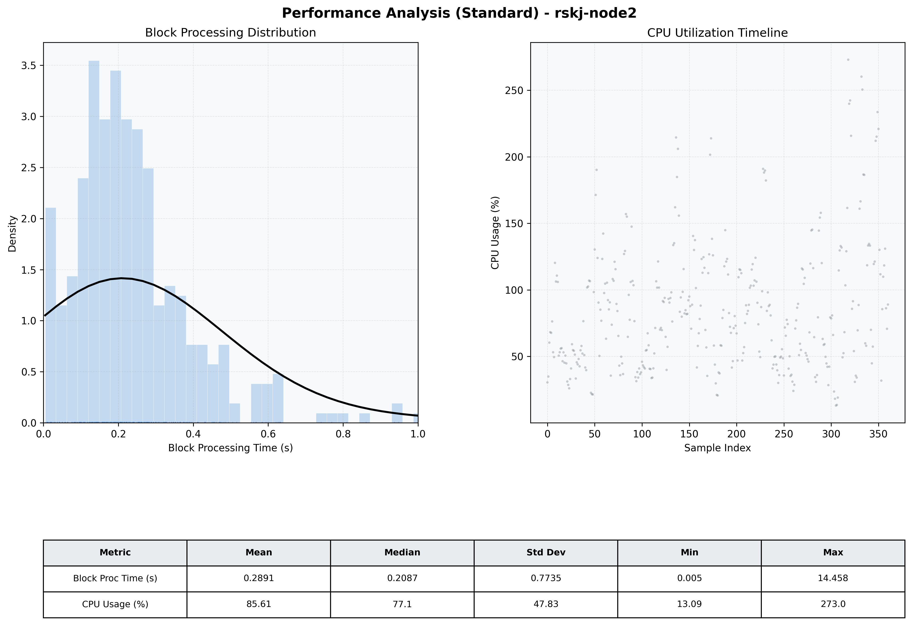

# Node2 Quantitative Performance Report

| Category | Metric | Unit | Mean | Median | Min | Max |
| :--- | :--- | :--- | :--- | :--- | :--- | :--- |
| Processing | Block Processing Time | s | 0.289 | 0.209 | 0.005 | 14.458 |
|  | BlockExecution JMX | s | 0.175 | 0.147 | 0.002 | 0.969 |
| | Gas Consumed (per block) | M units | 8.09 | 9.23 | 0.00 | 9.97 |
| Resources | CPU Usage per Container | % | 85.61 | 77.13 | 13.09 | 272.99 |
|  | Memory Usage per Container | MiB | 4036.8 | 4056.5 | 3765.5 | 4095.8 |
| | CPU & Memory Assigned | - | 2.0 CPU, 4G | - | - | - |
| JVM | JVM Heap Used | MiB | 1553.7 | 1488.9 | 838.6 | 2683.1 |
| | JVM Heap Allocated | MiB | 3072.0 | 3072.0 | 3072.0 | 3072.0 |
| JVM GC | GC Copy Time | s | N/A | N/A | N/A | N/A |
| JVM GC | GC MarkSweep Time | s | N/A | N/A | N/A | N/A |
| Disk I/O | Disk Read | MiB/s | 167.368 | 20.407 | 0.000 | 8594.973 |
|  | Disk Write | MiB/s | 289.250 | 31.313 | 0.690 | 13438.009 |
| Network | Received Network Traffic per Container | KiB/s | 170.48 | 161.83 | 1.55 | 484.68 |
|  | Sent Network Traffic per Container | KiB/s | 142.38 | 130.24 | 9.79 | 435.80 |

